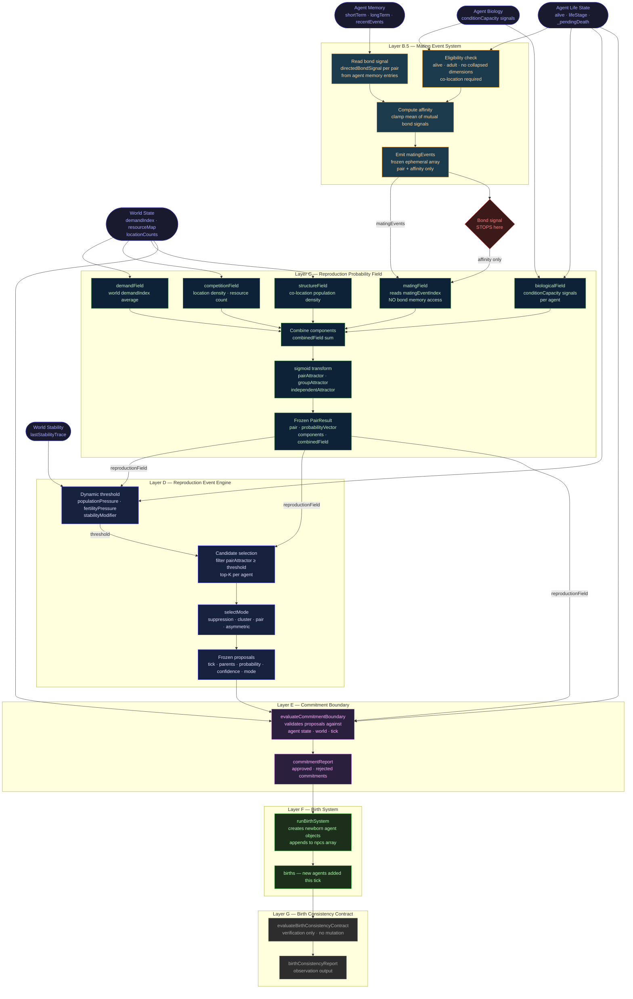

# Earthly Life Continuum — Causal Architecture v1

Authority: [AGENTS.md](../../../AGENTS.md)
Source of truth for tick order: [tickManager.js](../../../src/simulation/tickManager.js)

This document defines the causal diagram set for the Earthly simulation system.
It records, not prescribes. All diagrams are derived directly from the implemented
tick execution sequence. No future systems are represented.

---

## 1. Reading Rules

- All flow is **top-to-bottom, left-to-right**.
- Every edge is a **strict causal dependency**: the target cannot begin until the
  source produces its output.
- **No back-edges exist within a single tick.** Cross-tick feedback is annotated
  where it occurs.
- The diagram omits trace emission edges to keep signal paths readable. Trace
  output is purely observational and does not constitute causality.
- Layer labels (B.5, C, D …) are local to the reproduction sub-chain and do not
  imply a global layer numbering scheme.

---

## 2. Diagram 1 — Full Life Continuum

Covers the entire `tickManager` execution sequence in a single directed graph.

```mermaid
flowchart TD
    %% ─── Tick Boundary ───────────────────────────────────────────────
    TICK_START([Tick N begins])

    %% ─── Phase 1 · Pre-agent setup ───────────────────────────────────
    TICK_ADV[Advance worldObj.tick]
    LIFE_K[Life Kernel\nrunLifeKernel per agent\nage · lifeStage · _pendingDeath]
    ID_BEGIN[Identity-Free Begin\nbeginIdentityFreeTick\nstrips derived identity metadata]
    TRACE_BEGIN[Begin Trace Collection]
    DEMAND[World Demand\ncalculateWorldDemand\nwrites demandIndex]

    %% ─── Phase 2 · Agent simulation loop ─────────────────────────────
    SIM_LOOP[[simulateAgent loop\nfor each agent]]

    MEMORY[Memory init · decay · recall\nlearnKnowledgeFromMemories]
    PERCEPTION[Perception\nperceive · evaluateNeeds\ncreateInfluenceField]
    INTENT[Intent Pipeline\nfilterRegisteredActions\nintentPipeline.execute\nbuildAgentTypologySnapshot]
    EXEC[Action Execution\napplyActionEffects · mana update\ncommunication transfer · yield]
    REINFORCE[Internal Reinforcement\nrecordActionOutcome · applySkillGain\nadvanceNeeds · createRuntimeSnapshot]
    AGENT_TRACE[Record Agent Trace]

    %% ─── Phase 3 · Reproduction pipeline ────────────────────────────
    MATING[Mating Event System\ncomputeMatingEvents\nreads Bond signal · location · condition\nemits ephemeral matingEvents]
    REPRO_FIELD[Reproduction Probability Field\ncomputeReproductionProbabilityField\nreads matingEvents · biology · competition\ndemand · structure\nNO direct bond access]

    %% ─── Phase 4 · World physics ──────────────────────────────────────
    RES_FLOW[Resource Flow\nrunResourceFlowTick\nconsumes action-yield snapshots]
    FIELD_DYN[Field Dynamics\ncommitFieldDynamics\napplies perturbation queue]
    EMERGENCE[Coupled Emergence\nemergenceTickHook\nqueues future field perturbations]
    STABILITY[Stability Controller\nrunStabilityController\nwrites stabilityGains]

    %% ─── Phase 5 · Identity restore ──────────────────────────────────
    ID_RESTORE[Identity Restore\napplyPostTickIdentity\nderives identity metadata]

    %% ─── Phase 6 · Reproduction resolution ──────────────────────────
    REPRO_ENG[Reproduction Event Engine\nrunReproductionEventEngine\nreads only reproductionField\nno bond · no mating access]
    COMMIT_BOUND[Commitment Boundary\nevaluateCommitmentBoundary\nvalidates proposals]

    %% ─── Phase 7 · Life finalisation ─────────────────────────────────
    DEATH[Finalize Pending Deaths\nfinalizePendingDeaths\ncreates corpse resource entries]
    BIRTH[Birth System\nrunBirthSystem\nappends newborns to npcs]
    BIRTH_CONTRACT[Birth Consistency Contract\nevaluateBirthConsistencyContract\nverification only]

    TICK_END([Tick N ends])

    %% ─── Edges ────────────────────────────────────────────────────────
    TICK_START --> TICK_ADV
    TICK_ADV --> LIFE_K
    LIFE_K --> ID_BEGIN
    ID_BEGIN --> TRACE_BEGIN
    TRACE_BEGIN --> DEMAND
    DEMAND --> SIM_LOOP

    SIM_LOOP --> MEMORY
    MEMORY --> PERCEPTION
    PERCEPTION --> INTENT
    INTENT --> EXEC
    EXEC --> REINFORCE
    REINFORCE --> AGENT_TRACE
    AGENT_TRACE --> SIM_LOOP

    SIM_LOOP -->|all agents done| MATING
    MATING -->|matingEvents| REPRO_FIELD

    REPRO_FIELD --> RES_FLOW
    RES_FLOW --> FIELD_DYN
    FIELD_DYN --> EMERGENCE
    EMERGENCE --> STABILITY
    STABILITY --> ID_RESTORE

    ID_RESTORE --> REPRO_ENG
    REPRO_FIELD -->|reproductionField| REPRO_ENG
    REPRO_ENG -->|proposals| COMMIT_BOUND

    COMMIT_BOUND --> DEATH
    DEATH --> BIRTH
    BIRTH --> BIRTH_CONTRACT
    BIRTH_CONTRACT --> TICK_END

    %% ─── Causal boundaries ────────────────────────────────────────────
    classDef execution fill:#1a1a2e,color:#e0e0ff,stroke:#4a4aff
    classDef decision  fill:#16213e,color:#c8f0c8,stroke:#2a7a2a
    classDef repro     fill:#0f3460,color:#ffd6a5,stroke:#ff9900
    classDef life      fill:#1b1b2f,color:#ffb3b3,stroke:#cc3333
    classDef observe   fill:#2d2d2d,color:#aaaaaa,stroke:#555555

    class TICK_ADV,DEMAND,EXEC,REINFORCE,RES_FLOW,FIELD_DYN,EMERGENCE,STABILITY,ID_RESTORE,ID_BEGIN execution
    class MEMORY,PERCEPTION,INTENT,AGENT_TRACE decision
    class MATING,REPRO_FIELD,REPRO_ENG,COMMIT_BOUND repro
    class LIFE_K,DEATH,BIRTH,BIRTH_CONTRACT life
    class TRACE_BEGIN,SIM_LOOP observe
```



### Phase Summary

| Phase | Steps | Domain |
|---|---|---|
| 1 | Tick advance · Life kernel · Identity begin · Demand | Setup |
| 2 | simulateAgent loop (per agent) | Cognition + Execution |
| 3 | Mating Event System · Reproduction Probability Field | Reproduction input |
| 4 | Resource flow · Field dynamics · Coupled emergence · Stability | World physics |
| 5 | Identity restore | Metadata |
| 6 | Reproduction Event Engine · Commitment Boundary | Reproduction resolution |
| 7 | Death finalisation · Birth System · Birth Consistency Contract | Life terminus + genesis |

---

## 3. Diagram 2 — Reproduction Pipeline Only

Zooms into the reproduction sub-chain. Shows the strict layered isolation
between the Bond system, the Mating Event System, the Probability Field,
and the Event Engine.



---

## 4. Diagram 3 — Mating Event Flow

Zooms into Layer B.5 only. Shows the internal computation steps of
`matingEventSystem.js` and the precise isolation boundary at which the bond
signal is consumed and converted into an affinity-only value.

```mermaid
flowchart TD
    %% ─── Inputs ───────────────────────────────────────────────────────
    ALL_AGENTS([agents — full NPC array\npassed from tickManager])

    %% ─── Eligibility gate ─────────────────────────────────────────────
    ALIVE_CHECK{agent.life.alive !== false\nand not _pendingDeath}
    STAGE_CHECK{lifeStage === adult}
    COND_CHECK{no collapsedDimensions\nresolveConditionSignals}
    LOCATION_CHECK{agentA.location ===\nagentB.location}
    ELIGIBLE([Eligible agent subset\nsorted by id for determinism])

    %% ─── Bond signal extraction ───────────────────────────────────────
    subgraph BOND_LAYER ["Bond Signal Layer  (read-only)"]
        MEM_SCAN_A[Scan agentA memory\nshortTerm + longTerm + recentEvents\nfilter entries referencing agentB.id]
        MEM_SCAN_B[Scan agentB memory\nshortTerm + longTerm + recentEvents\nfilter entries referencing agentA.id]
        DIR_A[directedBondSignal A→B\nclamp mean entry.strength/100]
        DIR_B[directedBondSignal B→A\nclamp mean entry.strength/100]
        MUTUAL[bondAffinity\nclamp mean of both directed signals]
    end

    %% ─── Affinity threshold ───────────────────────────────────────────
    AFFINITY_GATE{affinity > 0}

    %% ─── Output ───────────────────────────────────────────────────────
    EMIT[Emit mating event\nObject.freeze pair + affinity]
    OUTPUT([matingEvents\nfrozen ephemeral array\nno bond data · no memory refs\nno state written])

    %% ─── Isolation wall ───────────────────────────────────────────────
    ISOLATION_WALL{Isolation boundary\nOnly affinity scalar\ncrosses this line}

    %% ─── Downstream ───────────────────────────────────────────────────
    REPRO_FIELD([reproductionProbabilityField\nconsumes matingEvents\nvia matingEventIndex Map\nno direct memory access])

    %% ─── Edges ────────────────────────────────────────────────────────
    ALL_AGENTS --> ALIVE_CHECK
    ALIVE_CHECK -->|pass| STAGE_CHECK
    ALIVE_CHECK -->|fail| DISCARD1[ ]
    STAGE_CHECK -->|pass| COND_CHECK
    STAGE_CHECK -->|fail| DISCARD2[ ]
    COND_CHECK -->|pass| ELIGIBLE
    COND_CHECK -->|fail| DISCARD3[ ]

    ELIGIBLE -->|pair enumeration| LOCATION_CHECK
    LOCATION_CHECK -->|same location| MEM_SCAN_A
    LOCATION_CHECK -->|different location| SKIP[ ]

    MEM_SCAN_A --> DIR_A
    MEM_SCAN_B --> DIR_B
    DIR_A --> MUTUAL
    DIR_B --> MUTUAL
    ELIGIBLE --> MEM_SCAN_B

    MUTUAL --> AFFINITY_GATE
    AFFINITY_GATE -->|affinity > 0| EMIT
    AFFINITY_GATE -->|affinity ≤ 0| DROP[ ]

    EMIT --> OUTPUT
    OUTPUT --> ISOLATION_WALL
    ISOLATION_WALL -->|pair + affinity scalar only| REPRO_FIELD

    %% ─── Styles ───────────────────────────────────────────────────────
    classDef input   fill:#1a1a2e,color:#aaaaff,stroke:#3333aa
    classDef gate    fill:#2a1a1a,color:#ffaaaa,stroke:#cc3333
    classDef bond    fill:#1b3a4b,color:#ffd6a5,stroke:#ff9900
    classDef emit    fill:#1b2f1b,color:#b3ffb3,stroke:#33cc33
    classDef wall    fill:#3d1a1a,color:#ff8080,stroke:#cc0000
    classDef sink    fill:#2d2d2d,color:#888888,stroke:#444444
    classDef down    fill:#0d2137,color:#c8f0c8,stroke:#2a7a2a

    class ALL_AGENTS,ELIGIBLE input
    class ALIVE_CHECK,STAGE_CHECK,COND_CHECK,LOCATION_CHECK,AFFINITY_GATE gate
    class MEM_SCAN_A,MEM_SCAN_B,DIR_A,DIR_B,MUTUAL bond
    class EMIT,OUTPUT emit
    class ISOLATION_WALL wall
    class DISCARD1,DISCARD2,DISCARD3,SKIP,DROP sink
    class REPRO_FIELD down
```



---

## 5. Causal Isolation Contracts

The following contracts are enforced by this architecture and must remain true
across all future changes.

### Contract 1 — Bond does not reach Reproduction Probability Field

```text
Agent memory  →  Mating Event System  →  matingEvents[]
                                              ↓
                                 reproductionProbabilityField
                                 (reads affinity only, not memory)
```

`bondField` was removed from `reproductionProbabilityField.js` in the Mating
Event Causal Integrity v1 change. The component key `bond` no longer exists.
The component key `mating` is its replacement, populated exclusively from
`matingEvents[]`.

### Contract 2 — matingEvents are ephemeral

`computeMatingEvents` returns a frozen array. It does not write to any agent or
world object. Its output does not persist across ticks.

### Contract 3 — Reproduction Event Engine has no Bond or Mating access

`runReproductionEventEngine` receives only `reproductionField` (probability
vectors). It has no import of `matingEventSystem` and no direct memory access.

### Contract 4 — Execution order is deterministic

The tick execution sequence is fixed. Every run of `tickManager` with identical
inputs and world state produces identical `matingEvents`, `reproductionField`,
`proposals`, and `births`. Agent sorting by id before pair enumeration is the
determinism anchor.

### Contract 5 — No back-edges within a single tick

The diagrams above contain no cycles. Ecological feedback (action → field
perturbation → future perception) is a **cross-tick** loop, not a within-tick
cycle, and does not appear in the diagrams.

---

## 6. File Locations

| Diagram | File |
|---|---|
| Full Life Continuum `.mmd` | [docs/architecture/diagrams/EARTHLY_LIFE_CONTINUUM_V1.mmd](../diagrams/EARTHLY_LIFE_CONTINUUM_V1.mmd) |
| Reproduction Pipeline `.mmd` | [docs/architecture/diagrams/REPRODUCTION_PIPELINE_V1.mmd](../diagrams/REPRODUCTION_PIPELINE_V1.mmd) |
| This document | `docs/architecture/causal/EARTHLY_LIFE_CONTINUUM_V1.md` |

| Implementation | File |
|---|---|
| Tick execution authority | [src/simulation/tickManager.js](../../../src/simulation/tickManager.js) |
| Mating Event System | [src/simulation/mating/matingEventSystem.js](../../../src/simulation/mating/matingEventSystem.js) |
| Reproduction Probability Field | [src/simulation/reproduction/reproductionProbabilityField.js](../../../src/simulation/reproduction/reproductionProbabilityField.js) |
| Reproduction Event Engine | [src/simulation/reproduction/reproductionEventEngine.js](../../../src/simulation/reproduction/reproductionEventEngine.js) |
| Commitment Boundary | [src/simulation/reproduction/reproductionCommitmentBoundary.js](../../../src/simulation/reproduction/reproductionCommitmentBoundary.js) |
| Birth System | [src/simulation/reproduction/birthSystem.js](../../../src/simulation/reproduction/birthSystem.js) |
| Birth Consistency Contract | [src/simulation/reproduction/birthConsistencyContract.js](../../../src/simulation/reproduction/birthConsistencyContract.js) |

---

## 7. Related Architecture Documents

- [AGENTS.md](../../../AGENTS.md) — simulation constitution (sole authority)
- [TICK_RESPONSIBILITY_MAP_V1.md](../TICK_RESPONSIBILITY_MAP_V1.md) — domain ownership map
- [CAUSAL_LAYER_ISOLATION.md](../CAUSAL_LAYER_ISOLATION.md) — intent pipeline isolation
- [CAUSAL_CLOSURE_VERIFICATION_V1.md](../CAUSAL_CLOSURE_VERIFICATION_V1.md) — causal boundary verification
- [LIFE_CONTINUITY_CAUSAL_INTEGRATION_V1.md](../LIFE_CONTINUITY_CAUSAL_INTEGRATION_V1.md) — life system integration

---

*This document records current structural truth only. It does not propose refactoring, introduce new systems, or alter runtime behavior.*
