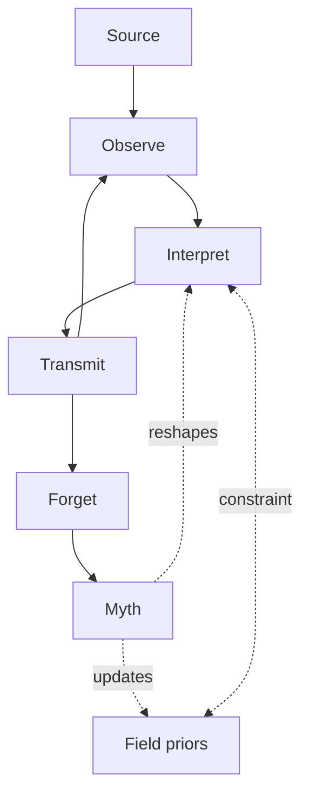
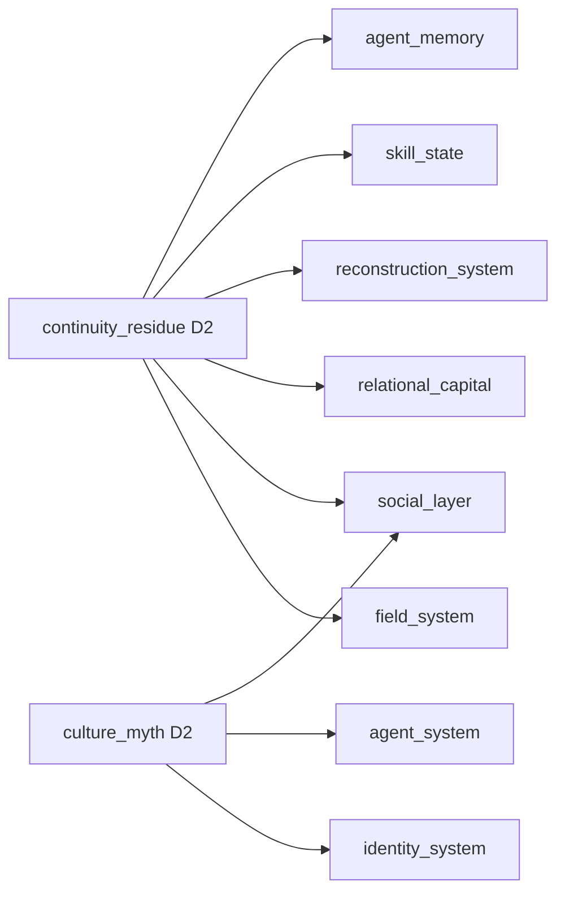

# Earthly Journey — Claude Sync Package

## LAYER 0 — SYSTEM HEADER
> Status: Draft | Version: 3.8-clean | Last updated: 2026-06-29
> Purpose: Long-term design decisions (LDD) baseline for all future Earthly Journey discussions with Claude.
> Rule: This document is the single source of truth. Discussions always sync back here.

### SYNC RULES

1. All Earthly Journey discussions default to this document as baseline
2. When a decision is locked, it moves from Open Decisions → its own section
3. Core Simulation Layer decisions are marked **IMMUTABLE** once locked
4. Rules/Systems Layer decisions are marked **ADJUSTABLE**
5. Content Layer decisions are marked **DATA-DRIVEN**
6. This document version-bumps on every locked decision

*Next version: v0.7 — after Social Layer relationship structure is locked*

---

## LAYER 1 — CANONICAL SYSTEM STATE

## Architecture Baseline（不可变前提）

```
Layer 0 — Core Simulation Layer   （不可变）
  Answers: What happened?
  Persists: Events

Layer 1 — Rules / Systems Layer   （可调整）
  Answers: How does the world update after events?
  Persists: States

Layer 2 — Relational Layer        （新增，待锁定）
  Answers: Who begins to include whom in their future model?
  Persists: Expectations

Layer 3 — Emergent Layer          （涌现，无 owner）
  Answers: Which patterns does the world retain long-term?
  Persists: Meaning
```

```
Layered persistence hierarchy:
  Core:       events persist       (what happened is recorded)
  Rules:      states persist       (what changed is tracked)
  Relational: expectations persist (who plans around whom is accumulated)
  Emergent:   meaning persists     (what it meant survives the rest)
```

```
Two generative chains for Emergent layer:

Chain A (event-driven):
  Core → Events → History
  Example: meteor impact, volcanic eruption, continental drift
  Produces: Event History (what occurred)

Chain B (relation-driven):
  Identity → Relational Capital → Relational Residue → Culture / Myth
  Produces: Relational History (what it meant to those involved)

These are distinct. Chain B requires the Relational Layer to exist.
Chain A does not.

Corrected claim:
  NOT: "History comes from relations"
  IS:  "Relational layer creates durable meaning carriers,
        from which culture and myth emerge"
```

All design decisions in this document map to one of these four layers.

---

## VISION（已锁定）

### Primary Statement
> Earthly Journey is a persistent simulation where identity emerges from accumulated actions and interactions, rather than predefined roles or progression paths.

### Core Loop
```
Do
→ Become
→ Influence
→ Become Again
```

### Secondary Principle
> Identity is not selected, unlocked, or assigned.
> Identity emerges from accumulated interaction with the world.

### Identity Composition
```
Identity ≠ Skill Collection

Identity = Capability
         + History
         + Constraints
         + Relationships
```

**Example:**
Same Cooking 80 — three different identities:
- Inn owner
- Wandering cook
- Army supply officer

Skills are the same. Identity is not.

---

## WORLD PRINCIPLE（已锁定）

> Earthly exists independently of players.
> Players enter the world. The world does not exist for players.

### Implications
- The world does not pause for players
- The world does not save/load for players
- Player actions affect the world, but do not own it
- History accumulates regardless of player presence

### Player Role
```
Not: Protagonist
Not: Hero
Is:  Participant / Observer / Intervener
```

---

## PLAYER STRUCTURE（已锁定）

```
Primary Mode:    MMO — multiple actors in one persistent world
Development:     Single observer / beta tester entering running simulation
Excluded:        World designed around player convenience
```

> The beta / solo phase is not "single player mode."
> It is: Observer Intervention Sandbox — one human entering a world that already runs.

---

## PERSISTENCE（已锁定）

```
Type:            Full Persistent World
Implementation:  Lazy Simulation + Event Compression + Priority Zones

Principle:
  The world advances continuously in concept.
  Computation executes on-demand, not every tick.

Execution triggers:
  - On player zone entry
  - On scheduled catch-up intervals
  - On major world transitions
  - On sleep / wake cycle
```

**Example output (player returns after absence):**
```
You left for 18 days.

The northern road became unsafe.
Your apprentice opened his own shop.
A nearby village adopted your irrigation method.
Someone bought your old house.
```
These are not quest rewards. They are world consequences.

---

## TIME SYSTEM（已锁定）

```
Type: Layered Simulation Time

Macro Layer — Civilization
  Unit:      Generational cycles (multi-year)
  Drives:    Cultural drift, political structure, long-term ecology

Meso Layer — Economy / Society
  Unit:      Monthly to yearly
  Drives:    NPC lifecycle, trade dynamics, population shifts

Micro Layer — Interaction
  Unit:      Real-time or near real-time
  Drives:    Player action, combat, conversation, local events
```

**Key Principle:**
> Time is not uniform.
> Time is a modeling tool for different system scales.

Player actions occur at Micro, but propagate upward to Meso and Macro over time.

---

## NPC SYSTEM（已锁定）

```
NPCs are mortal agents with full lifecycle:
  birth → development → aging → death

Persistence priority:
  NOT individual NPCs
  BUT population structures and social systems
```

### Core Principle
```
Individuals die.
Structures persist.
World evolves.
```

### Mechanisms
1. **Generational Drift** — Skills, values, and professions drift across generations, not copy
2. **Social Structure Inheritance** — Families, guilds, villages, professions persist across death
3. **History as Population Change** — World history = result of population structure shifts, not scripted events

### Design Constraints (from NPC lifecycle)
- Tasks/quests bind to **social roles**, not individual NPCs
  - ✅ "Village Chief" (position)
  - ❌ "NPC_ID_4471 named Elder Wu"
- Player influence must be **structural**, not personal
  - ✅ Change trade routes, security levels, education access
  - ❌ Change one NPC's mood

---

## RESOURCE SYSTEM（已锁定）[Core Simulation Layer — IMMUTABLE]

```
Type: Multi-layer ecological + social resource model
```

### Four-Layer Structure

```
1. Renewable    （Flow Resources）
   Examples:    Wood, crops, animal populations
   Behavior:    Dynamic equilibrium + fluctuation
   Key:         Regeneration depends on environmental state, not fixed tick

2. Extractable  （Stock Resources）
   Examples:    Ore, water source, rare materials
   Behavior:    Difficult to recover once depleted
   Key:         Depletion → geopolitical restructuring

3. Constructed  （Human Infrastructure）
   Examples:    Buildings, roads, farmland, workshops
   Behavior:    Requires maintenance, naturally degrades
   Key:         Decay + reconstruction cycle

4. Relational   （Transfer Capacity）⭐
   Examples:    Knowledge, technology, trade access, alliance bonds
   Behavior:    Cannot be directly extracted
   Key:         Generated or transferred through interaction
                Represents actual transfer capacity — not perceived status

   Distinction from Emergent layer:
     Relational Resource = what can actually be exchanged or leveraged
                           (knowledge shared, alliance invoked, access granted)
     Reputation / Trust  = how others perceive and interpret your history
                           (emergent, not stored, not transferable as resource)

   Example:
     Knowledge of metallurgy → Relational Resource (can be taught, transferred)
     Prestige as master smith → Reputation (emergent from behavior history)
     These are distinct. Economy operates on Relational Resources.
     Social Projection operates on Reputation.
```

### Why Relational Layer is Non-Optional

Without it: world has physical economy but dead society.
Vision requires identity to emerge through interaction —
but interaction's medium is often non-physical:
- "Who is willing to trade with you"
- "Who remembers what you did"
- "Which city trusts you"
- "Whether your techniques have spread"

### Cross-Layer Flow

```
Physical Layer:
Extractable ↔ Renewable ↔ Constructed

Social Layer:
Relational Resources influence:
  - extraction efficiency
  - trade routes
  - population migration
  - technology diffusion
```

### World Stability Mechanisms（安全阀）

> Purpose: Not to prevent collapse, but to prevent irreversible information loss.
> The world may collapse. It must never reach an unsolvable state.

```
- Natural regeneration bias    (low baseline recovery always present)
- Migration pressure           (populations relocate instead of vanish)
- Resource diffusion           (slow spread, not teleportation)
- Fallback ecological states   (wasteland → secondary ecology)
```

---

## SKILL SYSTEM（已锁定）[Rules Layer — ADJUSTABLE]

```
Type: Hybrid Stability Model
```

### Three-Layer Structure

```
1. Hard Capacity Layer     （结构边界）
   - Limits simultaneous stable skill structures (slots)
   - Represents structural identity constraint of an entity
   - Not inventory — defines what kind of being you are

2. Operational Layer       （表达层）
   - Active skill expression is context-dependent and flexible
   - What is currently expressed within structural capacity
   - Interchangeable within structure

3. Temporal Drift Layer    （世界记忆层）
   - Skills strengthen with use
   - Unused skills decay over time
   - World shapes behavioral memory over time
```

### Core Redefinition

> Skills are not owned objects.
> Skills are stabilized behavioral patterns emerging from repeated action under structural constraints.

```
Skill ≠ Inventory item
Skill ≠ Equipment slot
Skill =  Behavioral inertia structure
```

### Slot Redefinition

```
Skill Slots are not inventory slots.

They are:
- Behavioral dominance channels
- Cognitive habit constraints
- Identity stabilization points

Slot ≠ Number of usable skills
Slot =  Maximum stable behavioral patterns this entity can maintain
```

### Identity = Semi-stable System

```
Identity =
  Hard Structure (slots)
+ Active Expression (equipped skills)
+ Historical Reinforcement (usage drift)
```

Not fully fixed (or it dies).
Not fully fluid (or it doesn't exist).
Has inertia (world memory) + has pressure (world feedback).

### Alignment with Core Loop

```
Act
→ Reinforce skill
→ Stabilize behavioral pattern
→ Constrain future action
→ New act shaped by constraint
```

### Design Constraints (from Skill System)
- ❌ Skills cannot be purchased or assigned
- ❌ Respec is not a default feature
- ❌ Skill slots are not an inventory system
- ✅ Skills emerge from repeated action
- ✅ Identity is readable from skill history, not skill list

### Growth Semantics（已锁定）

Growth in Earthly is not attribute accumulation. It is trajectory deformation.

Correct model:

```
behavior → maintenance cost change
         → stability change
         → recoverability change
         → performance change
```

Incorrect model (forbidden):

```
behavior → attribute delta  (e.g. Endurance +1)
```

Temporal Drift determines whether change occurs.
Narrative Projection determines whether change is felt.

Behavioral accumulation produces path dependence, not discrete advancement:

- repeated actions reduce attention cost
- sustained patterns change default scheduling
- history creates inertia, not penalty

Avoid: "gained A, lost B" (hidden attribute tree)
Prefer: "repeated behavior formed bias, changing future adaptation cost"

---

## PLAYER AGENT SYSTEM（已锁定）[Core Simulation Layer — IMMUTABLE]

### Definitive Statement

```
Player in Earthly is a long-lived native entity,
not a repeatable avatar or external controller.

Player continuity is biological continuity, not control continuity.
```

### Nature of Player in Earthly

```
Player is a world-native biological entity with an extended but finite lifespan.

- Follows identical world rules as all other agents
- No structural privileges beyond species-level traits
- First login = world records a new birth event
- Treatment: identical to any world-native entity entering existence
```

### Species Classification

```
Player Agent Species:
  - Same biological rule system as world
  - Extended lifespan parameter (dragon-like, not immortal)
  - Still subject to aging, entropy, and natural death
  - Appears long-lived to human NPC population
  - Is not supernatural — just a different species lifecycle parameter

Human NPC lifespan:    standard (~60-80 game years)
Player Agent lifespan: maps to real human lifespan (~60-80 real years)

At 4x world time:
  A player alive 80 real years = agent present through ~320 game years
  Naturally appears as a multi-generational presence to NPC society
```

### Age & Physiology Binding

```
Both age and physiological state anchored to real-world time 1:1.

Registration:  player inputs real age as starting point
Progression:   character ages and physically changes with real calendar time

Example:
  Player registers at age 20
  4 real years later → character is 24, body reflects 24 years
  World time elapsed → 16 game years

Design Intent:
  The player's Earthly agent is their parallel self, not a character.
  Agent and player grow old together in their respective timelines.
```

### World Time Multiplier（已锁定数字）

```
World time: 4x real time
1 real year = 4 game years
```

### Offline State

```
When player is not logged in, agent enters low-autonomy state.

NOT: freeze / dormancy (world does not pause for any entity)
IS:  reduced agency mode — agent persists in world with minimal self-direction

Low-autonomy behavior:
  - Agent exists in world records and continues to age
  - Agent performs only basic survival behaviors (does not starve, does not die from inactivity)
  - Agent does not make significant decisions or take meaningful actions
  - Agent is present but not influential — treated by world as a low-activity entity
  - World continues to evolve around the agent normally
  - Social structures retain memory of agent's past actions
  - Player reconnects to current world state; agent state reflects time passed

Distinction:
  Dormancy  = freeze (violates Continuity Principle)
  Low-autonomy = present but passive (consistent with world-native entity behavior)
```

### Identity Persistence Window（已识别，待定参数）

```
Identity pattern does not persist indefinitely after death.
It disperses over time as Field imprint fades.

Conceptual model:
  identity_decay:
    half_life:       TBD — influenced by Continuity Residue strength at death
    stabilization:   TBD — guardianship, memorialization, social memory slow decay
    full_dispersion: TBD — threshold beyond which reconstruction is no longer possible

Implications:
  - Long-ago deaths become harder or impossible to reconstruct
  - Guardianship of remains / active social memory delays decay
  - Natural death (lifespan end) → accelerated dispersion, no reconstruction
  - Time pressure makes reconstruction decisions meaningful

Open (Rules Layer parameters):
  - Actual half-life values
  - Whether Arcana skill affects decay rate
  - Whether dispersion can be slowed by Field-stable zones
```

### Natural Death

```
Agent lifespan is finite and tied to real player lifespan.

If player permanently stops logging in:
  - Agent continues in low-autonomy state until species lifespan limit is reached
  - Agent enters natural termination event
  - World processes this as a standard death for a long-lived entity
  - Identity disperses (accelerated — natural death bypasses reconstruction)
  - Legacy and social memory persist per standard world rules

No special treatment. No narrative event. World continues.
```

### Player Privilege Principle

```
Asymmetric participation under symmetric rules.

Players have species-level biological differences (extended lifespan).
Players have zero meaning-layer privileges.
Players have zero rule-override privileges.

The world processes player agents as world-native entities with extended parameters.
It does not assign special significance to player-specific traits.
```

---

## DEATH MODEL（已锁定）[Core Simulation Layer — IMMUTABLE]

### Core Distinction

```
Body continuity ≠ Identity continuity
Death ≠ disappearance
Death = ecological transition back into world systems
```

### Death Pipeline

```
1. Body death occurs (combat, accident, natural aging)
2. Organic decomposition begins immediately
   → meat enters food chain (predators, scavengers)
   → nutrients enter soil / Life Field
   → bones may be repurposed by ecosystem agents (goblins, etc.)
3. Material redistribution to local ecology
4. Field traces persist in region (identity footprint, diffused)
5. Optional reconstruction via Arcana + Field alignment
6. New body emerges from recycled world substrate
```

```
Player body after death:
  - Meat   → wolf consumes, life field absorbed
  - Soil   → plant nutrition, Earth/Life Field enrichment
  - Bones  → goblin crafts bone weapons, structural reuse

Nothing is removed from the world.
Everything is redistributed within the world.
```

### Identity During Death

```
Identity ≠ stored in body
Identity = distributed pattern in Field + material traces

After death:
  Body = decomposed into world
  Identity = persists as diffuse Field imprint (unstable, not stored)
```

### Reconstruction Model（Final）

```
Reconstruction = Arcana-mediated reassembly of identity-consistent structures
                 from recycled world substrates

NOT: creating new matter
NOT: consuming identity as resource
NOT: external energy injection
IS:  reverse assembly from distributed world state
```

```
Step 1 — Locate residual identity footprint
  Identity pattern is diffused in local Field after death
  Time pressure: the longer reconstruction is delayed,
  the more dispersed the pattern becomes

Step 2 — Gather available substrate
  Biomass from environment (may already have entered food chain)
  Structural remnants if accessible
  Local Field composition as scaffold

Step 3 — Arcana-driven re-binding
  Arcana = pattern re-stabilizer
  Higher Arcana precision → more complete identity-body mapping
  Lower precision → greater skill degradation in new body

Step 4 — New body emerges
  Not a copy — an approximation
  Skill mapping degrades because rebinding is inexact
  Body is genuinely new, built from whatever the world currently has
```

### Why This Model Is Consistent

```
✅ No external matter created
✅ No identity consumed as resource
✅ No system-external energy injected
✅ World ecology remains closed loop
✅ Death has real weight (body redistributed, reconstruction is difficult)
✅ Reconstruction difficulty increases with time and Field dispersal
```

### Identity Continuity Model（Three-Layer）

```
Core Layer (how world recognizes identity):
  - Social identity record persists automatically on death
  - "Character A" as social position does not disappear
  - NPC memory references Character A, not body instance

Rules Layer (what reconstruction costs):
  - Consciousness continuity: memory retained
  - Body discontinuity: physical skill mapping degrades
  - World resources consumed as scaffold (not as fuel)

Content Layer (how NPCs perceive it):
  - NPCs recognize Character A behaviorally
  - May observe "you seem off lately" (new body, different mapping)
  - Social memory of death event persists as interaction history
```

### NPC Interaction After Reconstruction

```
NPC: "Where were you yesterday?"
Character A_2: "Lost a fight with wolves. Recovery took time."

NPC does not ask "are you the same person?"
NPC observes behavior and updates interaction history accordingly.
```

### Continuity Residue Model（已锁定）

```
Why players can reconstruct, and most NPCs cannot:

NOT: "Players exist outside Earthly" (this would be meta-privilege)
IS:  "Players have stronger continuity structure"

Rule is symmetric. Capacity differs.
```

```
Continuity Residue — definition:
  After body death, not everything disperses immediately.
  A structured pattern persists in the Field temporarily:

  May include:
    - Unresolved intent structures
    - Long-term memory field imprint
    - Social identity binding
    - Neural field residue
    - Incomplete behavioral patterns

  This is NOT a soul.
  It is a persistent world state — measurable, subject to decay.
```

```
Continuity Stability by entity type:

  Player agents:
    Strong external connection anchor → Continuity Residue persists long
    Usually sufficient to self-initiate reconstruction

  Ordinary NPCs:
    Residue decays quickly after death
    Usually cannot self-initiate
    Reconstruction requires external assistance (player or other agent)

  Special NPCs (dragons, high-level mages, ancient individuals):
    May form persistent continuity structures
    Can self-initiate reconstruction under right Field conditions
    → This is how "legendary figures return" — mechanism, not plot
```

```
Reconstruction trigger:
  Not "who exists outside the world"
  But "who still has sufficient continuity structure to issue a request"

  Continuity Stability threshold determines:
    - Whether reconstruction is available
    - Which paths are accessible (Anchor / Wild)
    - Estimated reconstruction time
    - Projected entropy loss
```

```
Player UI after death (concept):

  Body Integrity:          0%
  Continuity Stability:    82%
  Field Reconstruction:    Available
  Estimated Time:          14h 23m
  Entropy Loss:            Skill Drift −0.8%

  [Anchor Reconstruction]  [Local Reconstruction]

  Reading: "Your existence structure remains sufficiently intact."
  Not:     "The system permits your revival."
```

```
Player assisting NPC reconstruction:
  Not granting permission.
  Not transferring privilege.
  Providing external Arcana to stabilize NPC's residue
  before it disperses beyond reconstructable threshold.

  This is help. Not authorization.
```

```
Agent reaches species lifespan limit:
  → Body enters natural decomposition
  → Identity pattern disperses fully over time
  → No reconstruction available (pattern too dispersed, biological limit exceeded)
  → Social memory and legacy persist in world structures
  → Player's participation in Earthly ends with their real lifespan
```

### Why Not Roguelike

```
Roguelike:  run ends → world resets → new run → fresh start
Earthly:    body returns to world → world continues → identity may reassemble → cost carried forward

The world never resets.
The body literally becomes part of the world.
Reconstruction is drawing yourself back together from what the world still holds.
```

---

## WORLD TIME & ONTOLOGY SPEC（Frozen v0.1）[Core Simulation Layer — IMMUTABLE]

> Frozen reference spec for cross-model alignment. Do not modify without full design review.

```
1. Time System
   - Single global continuous time axis
   - Fixed multiplier: 4x real time
   - Example: 15 real minutes = 1 game hour
   - World time does not pause or freeze for any entity or player state

2. Entity Equivalence Principle
   - All entities share one rule system: players, NPCs, creatures
   - No player exemption rules exist
   - ∀ entity ∈ World: RuleSet(entity) = RuleSet(World)

3. Continuity Principle
   - World runs continuously regardless of player online status
   - During disconnect: world advances, NPCs act, events resolve
   - Player reconnects into current world state, not a saved state

4. Causal Permanence Principle
   - All events enter an irreversible causal chain
   - No "unoccurred state" exists
   - No event deferred because player was not observing
   - Every event: recorded, affects world state, becomes history

5. Player Status Model
   - Player = interruptible entity
   - No time-pause rights, no state-protection rights
   - Disconnect = entity withdraws from current causal interaction

6. Death & Consequence Model
   - Death is a world state result, not a UI event
   - Can occur during player offline period
   - Result is traceable via causal log
   - Result is not guaranteed to be explanation-friendly

7. Core Philosophy Statement
   Earthly Journey is a continuous-world simulation where all entities
   evolve under a unified temporal and causal system.
   Players are non-central participants embedded within the same reality
   ruleset, not privileged observers.
```

---

## FIELD SYSTEM（已锁定）[Core Simulation Layer — IMMUTABLE]

### Definitive Statement

```
Field System is not a mechanic. It is a core ontological layer of Earthly.

Fields are continuous spatial-temporal distributions of fundamental forces.
All material, biological, and systemic phenomena emerge as stable or unstable
configurations of these fields.

Field = how the world exists, not a tool the world provides.
```

### Five Fields

```
Life Field    — biological flow, growth, healing, decay
Water Field   — fluid dynamics, purification, circulation, erosion
Earth Field   — structural stability, mass, geological process
Fire Field    — energy conversion, combustion, transformation
Arcana Field  — information, pattern, order, rule coherence
```

### Dual-Field Ontology（已锁定）

```
Earthly contains two distinct but mathematically isomorphic field systems.
They share the same abstract template:
  Field = distributed influence over a state space

But they operate on different state spaces:
```

```
Physical Fields (Magic / World Substrate):
  Fields:       Life, Water, Earth, Fire, Arcana
  Layer:        Core Simulation (world substrate)
  Acts on:      world state (matter, energy, biological process)
  Propagation:  continuous spatial physics
  Stability:    governed by physical laws + Field Saturation
  Interference: reaction, transformation, excitation
  Question:     "What happens?"

Semantic Fields (Social / Interpretation):
  Fields:       Interpretation Fields (emergent, not enumerated)
  Layer:        Rules → Emergent
  Acts on:      interpretation state (meaning, belief, behavioral tendency)
  Propagation:  discrete social network (agent-to-agent transmission)
  Stability:    governed by authority (compression shortcut) + repetition
  Interference: reinforcement, cancellation, phase shift
  Question:     "What does it mean?"
```

```
Bridge between layers:
  Physical events → enter propagation system → interpreted through Semantic Fields
  Semantic Fields → shape agent decisions → produce Physical events

  The Propagation Model (Source→Observe→Interpret→Transmit→Forget→Myth)
  is the coupling mechanism between the two field systems.
```

```
Cross-layer coupling (future, not yet defined):
  Magic affecting belief  → physical field event enters semantic field
  Belief affecting magic  → semantic field shapes agent's physical field interaction
  Authority stabilizing magic systems → semantic compression affects physical access

  Note: cross-layer coupling is not yet part of the locked design.
  Flagged as open decision for later phase.
```

### Authority Formation & Persistence（已锁定）

```
Authority is not a Field.
Authority is a Field Persistence Mechanism.

The question is not: "Does authority need physical carriers?"
The question is: "How does authority preserve its structure?"
```

```
Authority Threshold crossing:
  Generative Flux (density × repetition)
  ↓
  Repeated Interpretation (trust network forms)
  ↓
  Trust Network stabilizes
  ↓
  Authority emerges
  ↓
  Persistence Encoding achieved
  ↓
  Threshold crossed

  Definition of crossing:
    NOT "enough people believe it"
    IS  "the interpretation framework gains the ability to regenerate
         independently of its original propagation chain"
```

### Three Persistence Modes

```
Mode 1 — Embodied Authority
  Structure lives in: living people, ritual, oral transmission, social relationships
  Examples: tribal tradition, martial lineage, wolf pack hierarchy
  Behavior: propagation break → rapid decay; kill key nodes → authority collapses
  Conflict relevance: burning a village is effective

Mode 2 — Encoded Authority
  Structure lives in: text, law, temples, schools, monuments
  Examples: written religion, codified law, institutional doctrine
  Behavior: propagation break → can persist; destroy carrier → strong weakening
  Conflict relevance: burning books has real effect

Mode 3 — Distributed Authority
  Structure lives in: multi-node redundancy, multi-culture replication, multi-generational memory
  Examples: language, widespread folk beliefs, trade customs
  Behavior: destroy local nodes → minimal effect; requires sustained long-term erosion
  Conflict relevance: conquest ≠ erasure
```

```
Invariant rule:
  Authority survives only if enough structure remains
  to regenerate interpretation.
```

```
What conflict actually attacks (system semantics):

  Burning temple    → reduces Encoding Capacity (Mode 2 weakened)
  Burning books     → raises Reconstruction Cost (Mode 2 requires more effort to restore)
  Killing priests   → cuts Synchronization Nodes (Mode 1/2 propagation disrupted)
  Banning language  → damages Compression Manifold (all modes weakened)
  Massacre          → eliminates Embodied carriers (Mode 1 collapses)
  Long occupation   → erodes Generative Flux below sustainability threshold

  War is not only resource competition.
  War is attack on social memory regeneration capacity.
```


```
Candidate: Identity Field as coupling layer between Physical and Semantic

Current assessment:
  Identity System already exists at Core Layer.
  It accumulates behavioral history and produces Continuity Residue.
  It is influenced by both physical events and social interpretation.

  However: Identity in the current model is per-entity state, not a distributed field.
  For Identity to become a "field," it would need to:
    - Have spatial distribution (identity patterns spread across regions)
    - Have interference properties (identities affect each other's formation)
    - Have its own propagation mechanism

  This is partially present in:
    - Social Projection (how others' identities shape your perceived identity)
    - Skill transmission (how behavioral patterns spread across agents)
    - Generational drift (how identity patterns propagate across NPC generations)

  Verdict: Identity Field may be the correct framing for these phenomena,
           but it is not yet formally defined.
           Adding it prematurely risks conflating three separate mechanisms.

  Status: Open — flag for Phase 3 (after Economy and Conflict are defined)
          The question of whether Identity constitutes a true third field
          should be revisited once the full dependency graph is complete.
```

```
Fields are mutable. Behavior permanently shapes Field distributions.
World exhibits hysteresis — current state depends on history, not only current input.

A. Elastic Response (short-term)
   Disturbance → partial recovery
   Examples: combat, small harvesting, local skirmishes
   Characteristic: visible change, recovers over time

B. Plastic Deformation (sustained pressure)
   Repeated stress → field structure shift → path dependency emerges
   Examples: long-term mining, town expansion, agricultural development
   Characteristic: slow recovery, local ecology changes

C. Geological Memory (civilization-scale)
   Massive sustained interaction → stable irreversible field reconfiguration
   Examples: war ruins, depleted zones, sacred sites, anomaly zones
   Characteristic: effectively permanent, becomes world history
```

### Field Saturation Limit

```
Each region has a maximum disturbance capacity.
Exceeding saturation triggers cascading instability, not linear degradation.

Prevents: infinite pollution, infinite collapse, runaway depletion.
Saturation parameters are tunable (Rules Layer).
Saturation principle is immutable (Core Layer).
```

### Field Manipulation Physics（Magic System）

```
Magic = controlled induction of transient instability in localized Field Systems
        via Arcana capacity

Core Principle:
  Spells do not consume Field as a resource.
  Spells alter Field configuration, responsiveness, and temporal stability.
  World deforms. World does not deplete.
```

```
Three-layer model:

Layer 1 — Field (world state)
  Continuous distributions, not inventory
  Fire / Water / Earth / Life / Arcana

Layer 2 — Arcana Capacity (operator ability)
  Ability to impose structure on fields
  Determines: stability, precision, plasticity of Field interaction

Layer 3 — Spell (local structure event)
  Fireball = Arcana induces transient instability in Fire Field → energy release
  Not "generating fire" — reorganizing existing field into unstable state
```

```
Example: Fireball
  Mage Arcana 20 + Fire Field local state
  → Arcana imposes structure → Fire Field pushed into high-excitation state
  → Energy releases as fire event
  → Fire Field returns toward equilibrium (with fatigue residue)

NOT: Fire Field 100 → 80 (resource consumed)
IS:  Fire Field 100 → 100 (but responsiveness temporarily reduced)
```

```
Field Fatigue (long-term magical use):
  Repeated excitation → reduced Field responsiveness
  → Higher Arcana required for same effect
  → Recovery time increases
  → Sustained use → structural bias in region's Field pattern

Field Fatigue is Geological Memory applied to magical interaction.
```

```
Long-term consequences of magical activity:

  Fire mage residence area  → Fire Field pattern shifts, easier ignition or fatigue
  Ancient battlefield       → Arcana turbulence persists
  Sacred site               → Life Field resonance concentration
  Mining + earth magic zone → Earth Field structural bias toward instability
```

```
The world's current state depends on how it has been used,
not only on its current inputs.

✅ Regions have geological memory
✅ Civilizations leave structural traces
✅ War consequences cannot be cleared
✅ Resource depletion is real and path-dependent
✅ Sacred sites and dead zones emerge naturally from history
```

### Relationship to Resource System

```
Fields are not resources.
Fields are the medium through which resources exist.

Wood       = stable local configuration of Earth Field + Life Field
Fire       = high-excitation state of Fire Field
Biological recovery = Life Field self-organization behavior
Ore deposit = long-term Earth Field compression structure
```

### Relationship to Other Systems

```
Economy    → Field topology applied system (resource availability = field distribution result)
Combat     → Field disruption and destabilization
Cities     → Field stabilization zones (settlements persist where fields are stable)
Skill      → Player/NPC precision of Field interaction
Death      → Body breakdown releasing Field back into environment
Reconstruction → Field reorganization + identity rebind
Geography  → Field History Accumulation Zones (regions have memory)
```

### Reconstruction via Field（Final Model）

```
Reconstruction = field-mediated reassembly of a persistent identity pattern
                 into a viable physical body state

NOT: Field consumed as fuel
IS:  Field provides reconstruction substrate and stability conditions
```

```
Four-step process:

Step 1 — Death creates unstable structure
  Body     = destroyed
  Identity = persistent pattern (not material, not consumed)

Step 2 — Field provides reconstruction substrate
  Life Field   → biological structure tendency
  Earth Field  → material scaffold
  Arcana Field → information / memory coherence

Step 3 — Arcana / Skill determines reassembly quality
  Arcana = ability to re-bind identity pattern into matter
  Higher Arcana precision → more complete identity-body mapping
  Lower precision → greater skill degradation in reconstructed body

Step 4 — Physical constraints govern feasibility
  Required: stable Field zone, biological material, time window
  Constraints are structural requirements, NOT fuel being consumed
```

```
Conceptual equation:

Body_A(t+1) = Rebind(
    Identity_A,
    Field(Life + Arcana + Local Structure),
    Constraints(Material, Time, Field Stability)
)

Reconstruction is an approximation, not a perfect restoration.
This is why skill mapping degrades in new body — rebind is inexact.
```

```
Identity in this model:
  Identity ≠ resource (cannot be consumed)
  Identity = persistent field pattern that survives body termination

  After death: identity pattern persists but is unstable
  Reconstruction: pattern re-stabilized into new physical configuration
```

```
Why reconstruction has weight (not a button):
  - Requires stable local Field conditions
  - Requires physical material as scaffold
  - Requires Arcana capacity to mediate binding
  - Result is imperfect — degradation is real
  - Death is a difficult physical process to reverse, not an economic transaction
```

---
## SOCIAL LAYER（已锁定）[Rules Layer — ADJUSTABLE]

### Core Principle

```
Entities are not categorized by ontology (what they are),
but by interaction history (what they do).

World has no "identity query interface."
World only has a "social projection generator."
```

### Three-Layer Identity Model（已锁定）

```
Layer 1 — Internal Identity（内部连续性）
  Question:  "Who do I think I am?"
  Location:  Agent's continuity structure, behavioral tendency, skill bias
  Key:       Multi-skill coexistence natural, no class lock
             Identity Coherence lives here (hidden dynamic state)

Layer 2 — Relational Identity（关系记忆网络）
  Question:  "How does this specific NPC remember me?"
  Location:  Distributed across individual NPC memory instances
  Key:       Fully distributed, no global label
             NPC A: saved him / NPC B: owes money / NPC C: dangerous
             Independent states, not copies of one tag

Layer 3 — Social Projection（社会投影层）
  Question:  "How does society answer 'who are you'?"
  Location:  Not stored — dynamically generated on query
  Key:       Aggregates behavioral density from Relational Identity
             Produces contextual answer, not a lookup
```

### Social Projection Mechanism

```
Architecture Principle: No Global Query

World does not answer "who is who."
World only lets "who is perceived as who" gradually form.

Social Identity is NOT queried.
Social Identity is continuously approximated locally and emerges globally.
```

```
Wrong model:
  Query(world, "who is blacksmith?") → O(N) global scan → not scalable

Correct model:
  NPC local recall + neighbor propagation + emergent convergence
  O(1) local update + O(k) neighbor propagation → runs as background process
```

```
How "is there a blacksmith here?" actually resolves:

Step 1 — Local recall
  NPC does not query system.
  NPC asks: "Who do I remember fixing weapons?"

Step 2 — Social propagation (if unknown)
  NPC asks neighbor → neighbor gives a name
  Information diffuses through local network

Step 3 — Emergent convergence
  Through propagation, one agent "surfaces" as blacksmith
  Not because system designated them
  Because social paths converged on them
```

```
Each NPC maintains local belief state (not global graph):

  Villager A:    B is smith (0.8),  C is hunter (0.6)
  Blacksmith:    B is apprentice (0.9), C is unreliable customer (0.7)
  Merchant:      B is smith (0.5), C is guard-type (0.6)

No unified answer exists.
Only distributed cognition + local consensus.
```

```
Propagation constraints:
  - Information only travels through: gossip, trade networks, population migration
  - Information in city center: accurate (high-density network)
  - Information at frontier village: possibly outdated (slow propagation)
  - Recent major event: not yet diffused everywhere
  - Old major event: may be legend, may be forgotten
  
  Cost = propagation delay and density, not resource consumption.
```

### Multi-Identity Is Natural

```
System does not compress identity to single label.
System tracks behavioral density across all dimensions.

A person can simultaneously be:
  - High-frequency hunter
  - Skilled farm manager
  - Occasional tool crafter
  - Wind magic archer who cooks and does alchemy

Society does not ask: "Are you a farmer or a hunter?"
Society asks: "What are you most reliable for in this context?"
```

### Identity Coherence（活着时隐藏，死亡后显示后果）

```
Living state:
  Identity Coherence is a hidden dynamic state
  Player never sees a number
  Player feels: skill fluency, confidence, familiarity, sense of purpose

Death state:
  Coherence freezes as Reconstruction Snapshot
  Player sees qualitative estimate, not percentage:

  "Field Reconstruction Available
   Expected Recovery: High / Expected Drift: Low
   Estimated Time: 14h
   [Anchor Reconstruction] [Local Reconstruction]"

  Or in unstable zone:
  "Field unstable. Reconstruction possible. You may return changed."

Post-reconstruction:
  Player sees behavioral consequences, not numbers:
  "Fine motor memory slightly affected.
   Recent combat skills degraded.
   Emotional resonance partially shifted."

Coherence properties:
  - Not a resource pool
  - Not a permanent death counter
  - Snapshot at death governs reconstruction quality
  - After reconstruction: new Coherence forms fresh from current life
  - Rises or falls based on life experiences, relationships, goals
```

### Dual-Layer Memory Structure（已锁定）

```
Individual Memory (ephemeral):
  Stored in NPC entities
  High fidelity, short lifespan, dies with NPC

Social Structure Memory (persistent):
  Stored in groups, factions, organizations
  Aggregated from historical interactions
  Persists beyond individual NPC death

Individuals die. Structures persist. World evolves.
```

### Behavioral Transmission

```
Culture = stable transmission of behavioral patterns across generations
NPCs do not form abstract beliefs — only inherit behavioral heuristics.

"Wolves are dangerous" is not stored as concept.
It is stored as: "encounter wolf → trigger avoidance behavior."
```


> 本节遗留 Open 项见 LAYER 3 — OPEN / NEXT EVOLUTION → "Social Layer — Pending"

### Reconstruction Location Model（已锁定）[Rules Layer — ADJUSTABLE parameters]

```
System Name: Field Reconstruction System
Core Principle: Same underlying mechanism as all Field construction events.
  Fireball = instantaneous Field structure (unstable, releases energy)
  Body     = sustained Field structure (requires stabilization time)
  Both are Field Construction. Different stability constraints.
```

**Five-Stage Process:**

```
Stage 1 — Death Event
  Body instance terminates
  Identity anchor preserved (not deleted)
  Entity enters reconstructable state

Stage 2 — Player Decision
  Player chooses reconstruction path:

  A. Anchor Reconstruction
     - Known Field-stable zone (city, sacred site, ancient forest)
     - Higher Field stability → shorter stabilization window
     - Lower reconstruction entropy → less skill drift
     - Anchor may be natural (non-destroyable) or constructed (destroyable)

  B. Local Field Reconstruction (Wild)
     - Death location or nearby zone
     - Field stability varies by location history
     - Higher reconstruction entropy → greater skill drift
     - Very unstable zones → possible partial reconstruction

Stage 3 — Field Construction
  World executes reconstruction process
  Not "manufacturing a body" — re-converging a stable biological Field structure
  Player issues the request. World performs the process.

Stage 4 — Stabilization Window
  Reconstruction is not instantaneous
  Body gradually regains function (nervous system, motor mapping, memory alignment)
  Timer visible to player (reflects Field reorganization speed at chosen location)
  Analogous to: tree growth, not button press

Stage 5 — Cost Application
  Skill drift applied on completion
  Not a penalty — reconstruction entropy
  Field reconstruction does not achieve 100% alignment with prior state
  Information loss during dispersal + reassembly = permanent slight divergence

  Possible cost types (tunable parameters):
    - Skill progress regression
    - Neural drift (minor capability shift)
    - Fatigue debt (temporary performance reduction)
```

```
Field Noise Principle:
  Reconstruction entropy exists because:
    - Field is never perfectly stable during reassembly
    - Identity pattern loses fidelity during dispersal period
    - Re-convergence introduces structural approximation errors

  Skill loss = reconstruction entropy
  Not punishment. Physics.
```

```
Anchor types:
  Natural:     ancient forests, field convergence zones, geological stable points
               → cannot be destroyed, only slowly degraded over long time
  Constructed: temples, settlements, reconstruction workshops
               → can be built and destroyed, strategic value in conflict
  Wild:        any location, Field stability varies by event history
```

```
Identity continuity by path:
  Anchor: memory intact, NPC perceives minimal change, skill decay moderate
  Wild:   memory may have short gaps, skill decay heavier
          Social Layer record (Character A) unchanged in both cases
          NPC still recognizes you — you just "look rough"
```

---
## SOCIAL PROPAGATION MODEL（已锁定）[Rules Layer — ADJUSTABLE parameters]

### Six-Node Pipeline

```
Source
  ↓
Observe
  ↓
Interpret   ← Field constraints (bidirectional coupling)
  ↓
Transmit
  ↓
Forget
  ↓
Myth
  ↑ (reshapes Interpret)
```

### Node Definitions

```
Source:
  Any event, behavior, or observation that enters the propagation system.
  Examples: combat outcome, trade deal, death, construction, weather event.
  No event is inherently "significant" — significance is assigned at Interpret.

Observe:
  Agent perceives Source (directly or via Transmit from another agent).
  Observation is local, partial, and perspective-dependent.
  What is observed ≠ what occurred. Perception is already filtered.

Interpret:
  Agent assigns meaning to observation.

  Key principle:
    Interpret is always local (agent-level inference).
    Interpret is never unconstrained (field-constrained decoding).

  Dual-layer structure:
    Private model:   agent's individual experience and memory
    Field priors:    shared constraint space (culture, myth, language, institution)

  Field priors function as compression manifold — not stored knowledge:
    1. Limit interpretation space (not all meanings are available)
    2. Provide default causal templates ("wolves attack because they are hungry")
    3. Control transmissible expression forms (what can be said / shared)

  Result: no shared interpretation exists.
          Only a shared constraint space within which interpretations form.

Transmit:
  Agent shares interpretation with others (gossip, trade, teaching, story).
  Transmission is not copying — it is re-encoding through transmitter's model.
  Each relay introduces fidelity loss and local reinterpretation.

  Propagation properties (tunable parameters):
    speed:    how fast information travels through network
    fidelity: how much meaning survives each relay

  Speed × Fidelity matrix:
    Fast + High fidelity  → News / direct witness account
    Slow + High fidelity  → Tradition / formal record
    Fast + Low fidelity   → Rumor / panic
    Slow + Low fidelity   → Myth / legend

Forget:
  Information decays in agent memory over time.
  Decay rate influenced by: emotional salience, social reinforcement, Field stability.
  Forgetting is not failure — it is compression.
  What survives forgetting becomes culturally stable.

Myth:
  Low-fidelity stable form that survives long-term propagation.
  Myth is not false — it is maximally compressed cultural information.
  Myth feeds back into Interpret: reshapes what future events "mean."
  This is the mechanism by which culture becomes self-referential.
```

### Bidirectional Coupling (Critical)

```
Bottom-up:
  Agent observations → local interpretations → transmit → aggregate → Field priors update

Top-down:
  Field priors → constrain individual interpretation → shape what gets transmitted

Without top-down: interpretation space explodes, propagation loses alignment
Without bottom-up: culture freezes (premature semantic lock-in)

Both directions must operate simultaneously.
Field priors are not static — they drift as aggregate interpretations accumulate.
```

### Propagation as Physical Process (Not Resource Transaction)

```
Cost = propagation delay + network density constraints
NOT = explicit resource accounting

Note (open decision):
  Propagation does consume attention, time, social bandwidth.
  Future spec should clarify why information does not spread infinitely.
  Current model: network topology and agent memory limits act as natural friction.
```

### Interpretation Field Model（已锁定）

```
Interpretation Fields are not cultural zones or faction labels.
They are interfering constraint manifolds operating in shared semantic space.

Architecture symmetry:
  Physical Fields       → force interference (overlapping distributions)
  Interpretation Fields → meaning interference (overlapping constraints)
  Propagation           → encoding interference (fidelity loss per relay)

This is a Unified Interference Architecture.
```

```
Multi-field interference produces three states (not "mixed culture"):

① Reinforcement
   Multiple fields align on same interpretation
   → That meaning becomes easier to adopt in this region
   → Analogous to resonance in physical fields

② Cancellation
   Fields oppose each other's interpretive templates
   → Semantic instability zone (confusion, contested meaning)
   → High creative / conflict potential

③ Phase Shift
   Same event interpreted as opposite in nature across field boundary
   → Cultural misreading flashpoint
   → Source of wars, schisms, sudden alliance breaks
```

```
Semantic geography emerges naturally:
  Same physical event → different interpretation in different regions
  Not because of region-based rules
  But because propagation encodes under different interference patterns
```

### Field Generation Rule（关键约束）

```
Interpretation Fields are NOT authored (not designed top-down).
They emerge from propagation density and decay from propagation absence.

Generation conditions:
  - Sustained high-frequency propagation of similar interpretations
  - Convergence over time → field strengthens

Decay conditions:
  - Population dispersal
  - Propagation network disruption (war, plague, migration)
  - Competing field interference exceeding reinforcement threshold

Warning: Field explosion problem
  ❌ Not: one field per faction
  ❌ Not: one field per region
  ❌ Not: one field per NPC
  ✅ Fields emerge and decay from propagation dynamics
     Number of active fields is a system output, not a design input
```

```
Field intensity function (v0.2 — corrected):

Three-layer structure (not flat multipliers):

Layer A — Generative Flux
  G = density × repetition_rate
  Role: signal production rate — determines if field has generative momentum

Layer B — Transmission Kernel
  T = trust × exp(-delay)
  Role: signal distortion / attenuation — determines how signal deforms in transit

Layer C — Structural Persistence
  S = authority function (topological constraint, not scalar multiplier)
  Role: memory persistence mechanism — determines if field can exist
        without active propagation

Field State (vector, not scalar):
  F(x,t) = vector(G × T) constrained by S

  density / repetition  → magnitude of field signal
  trust                 → direction bias of interpretation
  delay                 → phase shift (temporal distortion)
  authority             → topology constraint (what can be referenced without retransmission)

Authority redefined:
  NOT: emergent stabilizer (keeps field alive)
  IS:  compression shortcut (makes propagation symbolic rather than behavioral)

  Without authority:  myth must be retold to persist
  With authority:     myth exists by reference (text, law, doctrine, ritual)
  Effect:
    - repetition becomes unnecessary locally
    - trust becomes inherited rather than computed
    - propagation decouples from active behavioral transmission

Authority is itself emergent (cannot be directly created):
  Requires: sufficient trust + repetition + institutional encoding over time
  Result:   field achieves structural memory independent of propagation density
```




---
## DESIGN CONSTRAINTS（持续维护）

Already implied by Vision + World Principle:
- ❌ No class lock
- ❌ No equipment binding
- ❌ No stat inflation
- ❌ No daily quests
- ❌ No forced social interaction
- ❌ No respec as default
- ❌ No main quest forcing identity
- ❌ No talent tree determining personality
- ❌ No numeric advantage overriding accumulated experience
- ❌ No world pausing for player convenience
- ❌ No save/load time manipulation

---
## PROJECTION / CONTEXT / PROPAGATION MODEL v1.0（已锁定）
> 写入时间：2026-06-28
> 状态：Frozen

---

### 规则层（先于对象定义）

#### Projection Rule v1.0

```
Any object without independent primary persistence authority
cannot appear as a causal node.
```

推论：

```
Projection cannot appear as dependency graph root.
```

#### Projection Rule v1.1

```
A projection may contribute causal influence,
but cannot own causal persistence.

projection ∈ causal evaluation
projection ∉ causal storage
```

#### Projection Participation Rule v1.0

```
Projection may shape event evaluation
but cannot initiate state transition.

Only Events and States may enter causal storage.
```

#### Context Participation Rule v1.0

```
Objects may participate in event evaluation
without becoming event inputs.

Evaluation context cannot be snapshotted
and cannot appear in event records.

Context participation must not affect replay determinism.
```

---

### D-Class Split（对象分类修订）

原 D-class（Projection / Encoding Objects）拆分为两个子类，不共享规则：

#### D1 — Interpretive Encoding

```
对象: Authority Content

规则:
  Projection Participation Rule 适用
  进入 event record:     禁止
  snapshot:              禁止
  causal storage:        禁止
  参与 event evaluation: 允许（作为 context）
```

#### D2 — Residual Carriers

```
对象: Culture / Myth, Continuity Residue

规则:
  可通过 resulting state changes 间接修改 A-class 状态
  进入 event record:    允许（间接，通过状态变化记录）
  直接记录进 event:     禁止
  Projection Participation Rule: 不适用
```

---

### E-Class Audit Results（已锁定）

#### Social Projection

```
TYPE:              observer-local transient projection
INPUT:             Event + State（observer 侧本地，on query）
OUTPUT:            none
STORAGE AUTHORITY: none
RESIDUAL LEAKAGE:  none
RECOMPUTE:         on observation only
```

#### Reputation

```
TYPE:              derived observable descriptor
INPUT:             Social belief state
OUTPUT:            none
STORAGE AUTHORITY: inherited from Social belief state (A-class)
RESIDUAL LEAKAGE:  none
RECOMPUTE:         on observation only
DEPENDENCY NODE:   removed — observable only, not causal node
```

---

### Propagation Event Definition（已锁定）

```
Propagation Event:

  inputs:
    interaction
    social_belief_state
    relational_state

  context（not snapshotted, not causal storage）:
    authority_content

  outputs:
    event_record
    belief_update

  observer-derived（not event output）:
    social_projection
```

---

### Residual Leakage Taxonomy v1.0（已锁定）

```
Type I — State Injection
  直接修改 A-class 状态
  对象: Culture / Myth, Continuity Residue dispersal,
        Authority Content collapse（via belief update）

Type II — Constraint Reshaping
  改变允许发生的状态空间，不直接修改 A-class
  对象: Conflict topology, Coherence Domain, Liquidity threshold

Type III — Null Projection
  无存储，无残留，无 leakage
  对象: Social Projection, Price Projection, Reputation, C-class metrics
```

---
## ECONOMY LAYER（Phase 3 — 进行中）[Rules Layer]

### What Does Economy Exchange?

```
Economy does not exchange resources.
Economy exchanges future state transition capability.

Resources are carriers, not the fundamental unit of exchange.
```

### Three Exchange Categories

```
A. Material Opportunity
   Source:   Renewable, Extractable, Constructed resources
   Examples: grain, iron ore, ships, workshops
   Nature:   ability to change physical world state

B. Relational Opportunity
   Source:   technology, knowledge, Endorsement, access networks
   Examples: metallurgy technique, trade route access, guild membership
   Nature:   ability to change available action set

C. Environmental Opportunity
   Source:   Field topology, geographic position, climate cycles, Field resonance
   Examples: Life-Field-rich farmland, Arcana-stable reconstruction zone,
             sacred site with authority concentration
   Nature:   ability to change action efficiency within a location

   Key distinction:
     NOT: Field = resource (Field cannot be owned or extracted)
     IS:  Field distribution creates economic gradient
          Location has value because of its Field conditions,
          not despite them
```

### Economy Emerges from Asymmetry

```
Economy does not emerge from scarcity.
Economy emerges from asymmetry.

Scarcity is one form of asymmetry.
Field topology asymmetry is another.
Authority concentration is another.
Knowledge distribution is another.

All generate economic gradients. All drive exchange.
```

### Regional Economic Profiles (examples)

```
Farming village:
  High Life Field, moderate Earth Field, low Arcana
  → Agricultural surplus, population growth
  → Must import: enchanted tools, reconstruction capacity

Arcana city:
  High Arcana Field, high Constructed, low Renewable
  → Knowledge production, reconstruction hub, ritual economy
  → Must import: food, raw materials

War ruin:
  Low Life Field, Arcana turbulence, high Geological Memory
  → Anomalous materials, dangerous exploration value
  → Not suitable for settlement; high-risk high-asymmetry

Sacred site:
  High Life resonance, high Semantic Authority concentration
  → Reconstruction efficiency, healing, pilgrimage economy
  → Value partially derived from Interpretation Field (not only Physical)
```

### What Determines Value?

```
Value = irreplaceability × time sensitivity

Not scarcity alone (scarce things may have no irreplaceable function)
Not efficiency alone (efficient things may have substitutes)

High value = at this moment, no other means provides equivalent
             state transition capability

Value is a context function, not a fixed property.

Same iron mine: low value in peacetime, high value during siege
Same Life Field zone: moderate value normally, extreme value during reconstruction
Same knowledge: value rises as sole holder ages toward death
```

### Price Formation

```
Price is not an expression of value.
Price is a transient coordination artifact emerging from local
state-difference minimization under information asymmetry,
time pressure, endorsement constraints, and authority acceptance.

Formal framing:
  Price := argmin(|ΔState| subject to Exchange Feasibility)
  where:
    ΔState           = state difference between parties after exchange
    Exchange Feasibility = whether endorsement + authority + logistics can support it
```

```
Five-stage local price formation:

Stage 1 — Intent Propagation
  Demand is not a query. It is a propagation event.
  Spreads through social graph. Reaches candidates via network topology.

Stage 2 — Candidate Set Formation
  Filtered by: endorsement, proximity, authority acceptance
  Not a global search — a local network discovery

Stage 3 — ΔState Computation
  Each candidate evaluates: "can this satisfy the required state transition?"
  Includes: resource fit, time cost, risk, dependency created

Stage 4 — Negotiation (local game)
  Time pressure compresses offer space
  Information asymmetry determines strategic space
  Endorsement chain affects trust cost (transaction friction)

Stage 5 — Lock-in (ephemeral consensus)
  Temporary price object formed
  Does NOT enter global ledger
  Exists only within interaction window
  Becomes historical record after completion
```

```
Key implication:
  No "market price" exists in Earthly.
  Only: completed exchange history (observable)
  And:  price fields currently converging (in-progress)

  Price is a process output, not a system input.
```

### Liquidity

```
Liquidity L(x, t, region) — hidden variable

Determines:
  - Whether an item/capability can enter exchange space at all
  - Whether endorsement can propagate exchange intent
  - Whether price can be "discovered"

Effective Price = Theoretical Value × Liquidity Discount

Low liquidity → price collapse ("valuable but unsellable")
  Examples:
    Skill with no one nearby who needs it
    Resource in isolated Authority zone (no endorsement bridge)
    Time-locked opportunity (window has passed)
```

### Liquidity Dynamics

```
Liquidity is not a property of objects.
Liquidity is a cross-layer emergent accessibility field.

Definition:
  Liquidity(x, t) = P(successful state transition within bounded cost/time)

  Not "exchangeability" — the expected success probability of
  state transition under all active constraints.
```

```
Four-factor structure:

Liquidity(x, t) = f(
  network_density(x, t),       ← Social Propagation reach (awareness space)
  endorsement_coverage(x, t),  ← Relational legitimacy (permission space)
  field_stability(x, t),       ← Physical/environmental viability (possibility space)
  1 / state_transition_cost    ← Execution feasibility (cost space)
)

First three factors = generation drivers (upper layer)
Fourth factor = execution constraint (determines if drivers convert to actual liquidity)
```

```
State transition cost examples:
  Iron ore in village A    → low cost (accessible, tools available)
  Iron ore in mountain     → medium cost (requires equipment, time)
  Iron ore in war zone     → effectively infinite cost (cannot be economized)

  Liquidity is inversely proportional to state transition cost.
  High resource value + infinite transition cost = zero effective liquidity.
```

```
Liquidity decomposition:
  Opportunity Space  × network_density
  Permission Space   × endorsement_coverage
  Feasibility Space  × field_stability
  Execution Factor   × (1 / state_transition_cost)

  All four must be non-zero for liquidity to exist.
  Any single factor at zero → liquidity collapses regardless of others.
```

### Liquidity Manipulation Mechanics

```
State transition cost can be manipulated. This is how economic power operates.

Six manipulation levers:

1. Information Control (network_density manipulation)
   Suppress propagation of price information between regions
   → Buyer remains unaware of alternatives → transition cost stays artificially high
   Example: Merchant B prevents village A from knowing city B's iron price

2. Endorsement Gatekeeping (permission space manipulation)
   Control the Endorsement bridges between regions
   → New entrants cannot access exchange space without going through gatekeeper
   Example: Guild controls who can trade in city B's market

3. Field Disruption (feasibility space manipulation)
   War, ecological destruction, sustained magical interference
   → Field stability collapses → physical transition becomes impossible
   Example: Burning fields = not destroying food, destroying agricultural liquidity

4. Infrastructure Denial (transition cost manipulation)
   Destroy roads, bridges, ports, storage facilities
   → Logistics cost rises → effective liquidity drops
   Example: Sieging a city = not just military, liquidity strangulation

5. Authority Withdrawal (permission space collapse)
   Delegitimize the Authority that backs an exchange medium
   → Endorsements become unacceptable → permission space shrinks
   Example: Declaring a guild heretical = removing its endorsement validity

6. Conversion Monopoly (execution cost manipulation)
   Control the only facility capable of processing a resource
   → Everyone must pay your price or resource stays illiquid
   Example: Owning the only smelter in a region
```

```
Systemic consequences:

  Merchant behavior:
    Phase 1: exploit information asymmetry (arbitrage)
    Phase 2: build Endorsement bridges (become liquidity provider)
    Phase 3: control transition infrastructure (become liquidity gatekeeper)

  War as liquidity attack:
    Target 1: Endorsement networks (cut permission space)
    Target 2: Field stability (cut feasibility space)
    Target 3: Infrastructure (raise transition cost)
    Target 4: Information nodes (cut awareness space)
    Victory ≠ territory control
    Victory = opponent's liquidity collapses below viable threshold

  Poverty as structural liquidity exclusion:
    Low network_density (information doesn't reach them)
    Low endorsement_coverage (no one vouches for them)
    High transition_cost (physically cannot access exchange space)
    Result: resources exist but cannot be economized
    Poverty is not resource scarcity — it is liquidity imprisonment
```


> 本节遗留 Open 项见 LAYER 3 — OPEN / NEXT EVOLUTION → "Economy Layer — Pending"

---

## RELATIONAL CAPITAL（概念识别，待锁定）

> 来源：Cross-agent relation discussion
> 状态：概念已识别为独立系统层候选，不属于 Economy Layer，不属于 Social Layer
> 位置候选：可能成为独立的第四架构层（Relational Layer）

### Core Definition

```
Relational Capital =
  accumulated capacity to reduce future interaction uncertainty
  between specific agents, built from shared behavioral history

NOT: Endorsement (permission object — Agent grants Agent access)
NOT: Reputation (observation object — Society describes Agent)
NOT: Liquidity (exchange feasibility probability)

IS:  Persistent Cross-Agent State
     The compressed prediction capacity that emerges from shared history
     between two specific agents
```

### Semantic Layer Distinction

```
Endorsement:        Agent → Agent    (permission, transferable, revocable)
Reputation:         Society → Agent  (observation, emergent, not directly controlled)
Relational Capital: Agent ↔ Agent    (shared history, not transferable, decays without interaction)

These are not the same concept at different scales.
They operate on different objects and through different mechanisms.
```

### Correct Position in Dependency Structure

```
NOT this:
  Identity ↔ Relational Capital ↔ Social  (connector model — undersells causal role)

IS this:
  Identity → Behavior → Relational Capital → Social Projection → Reputation

  Identity ──────────────────────────────────────────────────┐
     ↓                                                        ↑ (long-term)
  Behavior                                                    │
     ↓                                                        │
  Relational Capital ──────────────────────────────────────── (Identity change)
     ↓
  Social Projection
     ↓
  Reputation
     ↓
  Endorsement
     ↓
  Liquidity
     ↓
  Economy
```

```
Key implication:
  Relation precedes society.
  Society emerges from observed relations.
  Economy emerges from society.

  The order matters: Identity → Relation → Social → Economy
  Not the reverse.
```

### Cross-Agent Relation Stages

```
Stranger
↓
Non-threat       (behavior history: no harm observed)
↓
Predictable      (behavior history: consistent pattern established)
↓
Trusted          (uncertainty about future interaction drops significantly)
↓
Collaborative    (behavior begins to incorporate the other's existence)
↓
Identity-coupled (presence of other changes how you define your own actions)
```

### Cross-Species Examples

```
Hunter + Wolf:
  Not: "benefit > cost" calculation
  Is:  repeated consistent behavior → wolf's prediction error about this human collapses
       → wolf begins to include hunter's presence in its behavioral planning
       → eventually: identity-coupled (wolf guards the empty house after death)
  System layer: Identity change, not Economy change

Human + Dragon:
  Dragon may not need human resources.
  What dragon lacks: non-replaceable perturbation sources.
  Human who engages = new observation window into the world.
  Dragon protects this human for identity enrichment, not utility.
  System layer: Dragon's Internal Identity expands

Beekeeper + Hive:
  Hive may classify beekeeper as stable environmental variable (like terrain)
  Over long time: Environment → Persistent Pattern → Trusted External Actor
  System layer: Hive's environmental model updated; not market exchange
```

### Relational Residue After Death

```
When Hunter dies:
  Identity: dispersing (Continuity Residue decays)
  Relational Capital: does not immediately zero

  Wolf continues patterns established through the relationship.
  Not economic calculation — behavioral structure persists.

  This is a new phenomenon:
    Relational Capital outlives one party
    Relation becomes an independent world state
    Not owned by either agent

  Connection to History / Culture / Myth:
    Relational Residue → observed by others → enters Social Projection
    → compressed into legend ("the wolf that guards the hunter's house")
    → becomes Cultural Attractor

  Relation is the generative unit of history.
  Not events. Not individuals. Relations.
```

### Properties

```
Relational Capital:
  - Cannot be directly transferred (unlike Endorsement)
  - Decays without continued interaction
  - Can survive one party's death (Relational Residue)
  - Crosses species boundaries (no shared Unit of Account required)
  - Asymmetric destruction rate (faster to destroy than build)
  - Generates Social Projection effects without requiring economic exchange
```

### Architectural Position（已确认）

```
Four-layer architecture:
  Core → Rules → Relational → Emergent

Relational Layer is distinct because it introduces a new persistence unit:
  persistent expectations between specific agents

This cannot be expressed by Core (no agent pairing)
nor Rules (rules govern all agents uniformly)
nor Emergent (emergent has no causal power — it is output, not input)
```

```
Dependency chain for meaning:
  Identity → Behavior → Relational Capital → Relational Residue (on death/separation)
                                              ↓
                                         Social Projection
                                              ↓
                                    History / Culture / Myth

  NOT: RK → HIS (direct)
  IS:  RK → RR → HIS / CUL / SP (residue must be observed and propagated first)

  Example:
    Hunter and wolf bond (Relational Capital)
    Hunter dies
    Wolf guards house (Relational Residue persists in wolf's behavior)
    Villagers observe (Social Projection picks up the pattern)
    Story spreads (Propagation)
    Becomes legend (Culture / Myth — step 5, not step 2)
```


> 本节 Open Question 见 LAYER 3 — OPEN / NEXT EVOLUTION → "Relational Capital — Open Question"

---

## CONFLICT MODEL（v1.0 — Frozen）[Rules Layer — ADJUSTABLE parameters]
> 写入时间：2026-06-27
> 状态：Frozen

```
Conflict =
  observable instability event

Condition:
  Exists two or more state-seeking systems (A, B, ...)
  such that A and B have mutually exclusive feasible transition sets
  within a shared coherence domain.

Conflict fires when:
  competing state transitions
  cannot be simultaneously satisfied
  within that coherence domain.

Conflict is NOT a Layer.
Conflict is NOT persistent.
Conflict is recomputed per tick.
```

```
Conflict Residue =
  persistent modification of transition feasibility
  after conflict event termination.

Conflict Residue injects into:
  Field System        (Geological Memory — stability modification)
  Social Layer        (belief_state, relationship_state)
  Relational Capital  (expectation error → RC decay or destruction)
  Economy             (exchange history, infrastructure, price artifacts)
  Identity System     (behavior events → P1 structural base)

Conflict Residue persists as modifications to host objects.
Conflict itself does not persist.
Conflict Residue decays with its host objects (indirect decay).
Geological Memory injection is effectively permanent at civilization timescales.
```

```
Coherence Domain =
  a causal graph region
  within which competing state transitions
  produce mutual interference.

Properties:
  - derived (NOT primitive)
  - derived from: Field causal reach ∩ Social propagation coupling reach
  - overlapping (NOT a partition of the world)
  - dynamically reconfigurable as Field and Social states change

Observability is NOT required.
Causal coupling IS required.
```

```
Rupture dimensions (non-ordered):
  - Resource flow disruption
  - Liquidity collapse
  - Relational expectation failure
  - Authority legitimacy fracture
  - Meaning coherence fracture

Ordering is context-dependent and emergent.
No default propagation sequence.
```

```
Conflict does not require intentional agents.
Agent conflict is a subset of world conflict.

Non-agent conflict examples:
  ecological succession
  species competition
  geological pressure
  Field interference between incompatible distributions
```

```
Dependency graph update:
  conflict_layer: pending → RESOLVED as recomputed observable (NOT a layer node)

  Conflict Residue: new derived node
    inputs: conflict_event
    outputs: modified transition feasibility
             injected into Field, Social, RC, Economy, Identity
```

---

## AUTHORITY FORMAL MODEL（v0.1 — Frozen）[Rules Layer — ADJUSTABLE parameters]
> 写入时间：2026-06-27
> 状态：Frozen

```
1. Authority = Field Persistence Mechanism
   (locked in Social Layer section, not repeated)

2. Authority Persistence Modes =
   alternative redundancy architectures for the same Authority signal.
   Modes: Embodied / Encoded / Distributed
   NOT fixed categorical types.
   Re-encoding between Modes is possible under constraint pressure.

3. Authority Migration =
   constraint-driven re-encoding
   triggered by viability loss in current architecture.
   Direction: threat-adaptive (NOT fixed ordering).
   Cost: irreversible fidelity loss + structural drift.
   Preserves: signal continuity. Does NOT preserve structural identity.

   Threat-type → vulnerable Mode mapping:
     Physical threat (war, death)    → Embodied most vulnerable
     Information control threat      → Encoded most vulnerable
     Network disruption threat       → Distributed most vulnerable
     Sustained time pressure (decay) → Embodied most vulnerable

4. Regenerative Flux =
   RF(t) = g(C, E, P) × coupling_factor(C, E, P)

   C = carrier density         (Mode 1 contribution)
   E = encoding reference rate (Mode 2 contribution)
   P = propagation density     (Mode 3 contribution)
   coupling_factor ∈ [0,1]
     = degree to which Modes can still sustain each other

   Compensation: partial, lossy, coupling-dependent, bounded.
   Substitutability is directional (S_ij ≠ S_ji).
   translation_loss applies on every cross-Mode compensation.
   Specific S_ij values = Rules Layer parameters (tunable).
   Flux structure = Core (not tunable).

5. Re-encoding Horizon =
   derived survivability budget

   H(t) = ∫ viability(t) dt

   viability(t) derived from:
     - RF(t)
     - coupling_factor(t)
     - active Mode distribution(t)
     - Conflict Residue pressure(t)

   H decreases continuously under unsustainable conditions.
   H is NOT a fixed time window.
   H is NOT dependent on Authority type or category.

   Collapse condition:
     H ≤ 0
     AND no successful re-encoding has occurred

   Successful re-encoding resets H trajectory
   (with fidelity loss and structural drift applied).

6. Authority resilience =
   function of:
     active Mode count × flux contribution × coupling_factor

   Multi-Mode Authority structurally more resilient than single-Mode.
   Resilience is a derived state, not a stored property.
```

```
Authority objects split:
  Authority Content  = the interpretation framework being preserved (D-class)
  Authority Integrity = the current structural state of the persistence mechanism (A-class)
  Authority Content continuity ≠ Authority Integrity continuity
  Same Content, migrated Integrity = same Authority, different structure
```

---

## TEMPORAL OBJECT TAXONOMY（v1.0 — Frozen）
> 写入时间：2026-06-27
> 状态：Frozen

### Five Object Classes

```
A. Persistent State
   Properties: stored / can decay / can reconstruct
   Primary persistence authority: one only (no multiple persistence authorities)
   Rule: Recompute and Persist cannot both be primary.

B. Event / Record
   Properties: append-only / never reconstruct / never recompute
   Role: irreducible causality trace

C. Derived Structure
   Properties: recomputed / not stored / can invalidate
   Note: caching is permitted but caching ≠ persistence

D. Projection / Encoding Objects
   Properties: partially stored / partially regenerated
   Warning: most complex persistence semantics

E. Emergent Aggregate
   Properties: dynamically generated / no owner / no storage location
   Critical distinction: computable ≠ queryable
     Emergent Aggregates have no authoritative global value,
     only local approximations within sub-networks.
```

### Six-Dimensional Audit Schema

```
For each object, exactly six fields:

Persist:     Y/N + Mechanism
Decay:       Y/N + Mechanism
Reconstruct: Y/N + Inputs + constraints
Recompute:   Y/N + Scope
Invalidate:  Y/N + Trigger
Continuity:  rule defining same-object identity over time

Primary persistence authority: one statement (what keeps it existing)
Storage authority: where reality of this object resides
```

### Temporal Audit Rule（Frozen）

```
Each object must have exactly one primary persistence authority.
Multiple persistence authorities create circular definitions.
Recompute and Persist cannot both be primary.
```

### A-Class Object Registry（v1.0）

```
Field state
  Primary authority: self-sustaining spatial distribution
  Continuity:        continuous causal substrate (NOT geographic coordinates)
  Decay:             elastic recovery (short-term) → plastic deformation → Geological Memory
  Invalidate:        N (only changes through physics)

Agent state
  Primary authority: biological continuity (body instance sustains Agent state)
  Continuity:        body continuity = Agent state continuity
  Invalidate:        Y — trigger: body death
  Note:              Agent state terminates on death;
                     Identity continuity may survive through Continuity Residue

Body instance
  Primary authority: biological integrity (Life Field + metabolism)
  Continuity:        physical continuity; death breaks continuity;
                     reconstruction = new instance
  Invalidate:        N (can only be damaged/killed/decomposed, not invalidated)

Skill state
  Primary authority: usage reinforcement under structural constraint (skill slot)
  Decay:             Attunement decays faster than capability boundary
  Reconstruct:       capped by reconstruction_quality_ceiling from Continuity Residue
  Invalidate:        Y — trigger: slot removal (possessed-but-unequipped = low-activity state)

Social belief state
  Primary authority: repeated reinforcement through propagation network
  Continuity:        semantic continuity of interpretation pattern
                     (survives full carrier replacement if pattern transmitted)
  Invalidate:        Y — trigger: single high-salience disconfirming event
                     (Invalidation ≠ Decay: decay is gradual, invalidation is threshold event)

Relationship state
  Primary authority: bilateral behavioral history between specific agent pair
  Storage:           distributed across both agent memory instances (asymmetric)
  Continuity:        agent-pair continuity; reconstruction = new instance
  Invalidate:        Y — trigger: agent death (one party)

Agent memory
  Primary authority: biological neural structure (body instance)
  Reconstruct:       severely constrained; quality capped by Continuity Residue
  Invalidate:        Y — trigger: body death
  Note:              storage medium rebuilt from scratch on reconstruction;
                     prior memories accessible only via Continuity Residue approximation

Relational Capital
  Primary authority: interaction renewal between specific agent pairs
  Storage:           distributed across both agent instances
  Reconstruct:       new RC instance inherits initial conditions from Relational Residue
                     (NOT from zero; NOT the Residue itself)
  Invalidate:        Y — trigger: agent death (one party)
                     RC terminates; Relational Residue persists separately

Conflict Residue
  Primary authority: structural imprint of transition feasibility modification
  Storage:           distributed across host objects (no independent storage)
  Reconstruct:       N (one-directional structural modification)
  Invalidate:        N (can only decay with host objects or be overwritten)
  Continuity:        continuity of host object modifications

Relational Residue
  Primary authority: behavioral pattern imprint after RC-generating relationship ends
  Storage:           surviving agent behavioral structure + world-observable patterns
  Reconstruct:       N (can seed new RC but cannot be directly reconstructed)
  Invalidate:        Y (partial) — trigger: strong disconfirming new relationship
  Note:              Social Propagation can extend effective persistence beyond agent

Infrastructure state
  Primary authority: maintenance throughput sustaining functional topology
  Continuity:        functional topology continuity (NOT material continuity)
                     function change = new instance; location destruction = termination
  Invalidate:        Y — trigger: functional topology below minimum viable threshold
                     (threshold crossing ≠ decay)

Institution state
  Primary authority: collective enactment maintaining operational legitimacy
  Storage:           distributed across member agents + social belief + encoded records
  Continuity:        operational mandate continuity
                     full collapse + revival = new instance (NOT reconstruction)
  Invalidate:        Y — requires BOTH enactment collapse AND legitimacy collapse
  Degraded states:   underground (enactment only) / hollow (legitimacy only)
                     both persist at reduced capacity without full invalidation

Knowledge state
  Primary authority: ability to reproduce the underlying transition
  Invalidate — K1 (Epistemic Loss):
    Trigger: no agent can reproduce transition AND no recoverable record exists
    Result:  knowledge removed from epistemic system entirely
  Invalidate — K2 (Ontological Obsolescence):
    Trigger: world conditions no longer support execution
    Result:  knowledge becomes non-executable historical trace
             (absorbed into Culture / Institution / History)
  Note: K1 and K2 are distinct mechanisms; must not be merged

Authority Integrity
  Primary authority: regenerative flux sustaining minimum viable persistence capacity
  Storage:           distributed across all active Persistence Modes
  Reconstruct:       Y (partial) — always with structural drift; H must not have expired
  Invalidate:        Y — trigger: H(t) ≤ 0 AND no successful re-encoding
  Continuity:        Authority signal continuity is SEPARATE from Authority Integrity continuity
                     signal loss beyond recovery threshold = new Authority instance
```

### Cross-State Persistence Coupling（Implicit, Not Expanded）

```
The following coupling relationships exist in the A-class registry.
They are implicit constraints, not independent system objects.
Expansion deferred to future audit phase.

Knowledge ↔ Institution:
  Institution Reconstruct requires Knowledge state availability
  Institution decay partially driven by Knowledge state decay

Conflict Residue ↔ Infrastructure:
  Conflict Residue is primary acceleration source for Infrastructure decay

Authority Integrity ↔ Social belief state:
  Authority Integrity legitimacy layer stored in Social belief state
  Social belief state decay directly suppresses Authority Mode 2/3 flux
```

### Event Ontology（B-Class Axioms — Frozen）

```
Event =
  minimal causal state transition in world substrate

Axioms:
  1. Observability NOT required
     Event exists regardless of agent observation
     Unobserved events: enter B-class record, do NOT propagate to Social Layer
     Social Layer cannot filter or gate Event existence

  2. Events remain separate entries (no coalescence)
     Interference patterns = C-class derived property
     Coherence domain does NOT determine Event merging
     (merging would reverse architecture dependency: Event → Coherence domain)

  3. Causal priority is derived (NOT stored)
     Event record does NOT contain causal links or priority tags
     Causal ordering reconstructed by C-class from timestamp + coherence domain overlap

Event record stores only:
  - pre-state snapshot (affected objects before)
  - post-state snapshot (affected objects after)
  - timestamp
  - affected object set

Event record does NOT store:
  - causality
  - interpretation
  - merged compound events
  - observability flags

Structural role:
  B-Class = pure causal trace layer
  No semantic resolution
  No structural aggregation
  No narrative construction
```


---

## D1 ARTIFACT MODEL v1.0（已锁定）
> 写入时间：2026-06-28
> 状态：Frozen
> 来源：本轮三方压测（Claude + ChatGPT + Yongkit）收敛

### 背景

本轮从 Authority Content 的 causal classification 问题出发，经过：

1. D1 Event Emission 能力问题（场景压测）
2. D1 是否 mutable 问题（二分被推翻）
3. Versioned Artifact 模型提出（ChatGPT）
4. event_record output artifact 要求补入（Claude）
5. Reference Resolution Rule 及 effective time 修正（三方收敛）

最终冻结 D1 Artifact Rule v1.0 和 Reference Resolution Rule v1.0。

---

### Design Philosophy Note (D1)

```
Prior assumption (废弃): meaning drives state
  D1 → A  (意义推动现实)

Corrected model (本轮锁定): state drives interpretation
  A → reference(D1)  (现实改变引用，引用改变解释)

Interpretation is not causal.
It is a resolution artifact computed from
reference topology + adoption history.

This reversal applies to all D-class objects:
  Authority Content
  Law / Doctrine
  Myth text
  Interpretive scaffold
```

---

### D1 Artifact Rule v1.0（Frozen）

```
1. D1 entities are immutable versioned artifacts.
   D1 is not a persistent state (A-class).
   D1 is not an event record (B-class).
   D1 is a versioned encoding object with no internal mutation.

2. D1 cannot emit propagation events.
   Grounds:
     - no agency (Agency(D1) = false → Emit(D1) = false)
     - no replay source (emission requires traceable causal origin)
     - Context Participation Rule v1.0 (D1 participates as context,
       not as causal source)

3. D1 cannot mutate in place.
   A-class stores references to D1 versions, not D1 internal state.
   "Authority changes" = new D1 version created, not existing D1 modified.

4. D1 instances may be produced as output artifacts of propagation events.
   D1 must appear in event_record outputs when created.
   D1 never appears as event emitter or causal source.

5. Authority / Law / Doctrine collapse is represented as reference
   adoption change inside A-class, not as D1 internal decay.
   D1 itself does not decay. Reference weight to D1 decays.
```

---

### Reference Resolution Rule v1.0（Frozen）

```
1. A-class does not overwrite D1.
   D1 is never modified by state transitions.

2. Reference changes are stored as append-only adoption records
   inside A-class.
   Adoption records: (effective_time, D1_version_id)

3. Effective D1 at time T is resolved from adoption record history.
   Resolution is computed, not stored.

4. Conflict resolution:
   When multiple adoption records share the same effective time,
   resolution follows event_record append order.
   Append order is canonical.

   Note: "effective time" ≠ "recorded time"
   Scheduled adoption and retroactive adoption are supported.
   D1 reference resolution always uses effective_time, not record timestamp.

5. Atomicity of reference switch across multiple A-class objects
   is Kernel-deferred.
   (Reference Switch Atomicity: pending Transition Kernel v0.1)
```

---

### D1 Class Reclassification（原 D-class 定义修订）

```
D-class 原定义（已部分修订）：
  "Projection / Encoding Objects: partially stored / partially regenerated"

D1 子类修订后定义：
  Versioned Artifact
  Properties:
    immutable       — no mutation after creation
    replaceable     — new version created, old version persists
    addressable     — referenced by version ID
    event-producible — instances appear in event_record as outputs
    non-emitting    — cannot initiate propagation events

D2 子类（Residual Carriers）定义不变：
  Culture / Myth, Continuity Residue
  可通过 resulting state changes 间接修改 A-class 状态
```


> D1 与 Dependency Graph 方向修正说明（v3.7 变更记录）见 LAYER 4 — CHANGE LOG / PATCH HISTORY → "D1 Direction Correction (v3.7)"

---

## PROPAGATION AXIOMS（Frozen）

### 1. Interpretation Saturation

```
Semantic Fields saturate, analogous to Physical Field Saturation.

Saturation is not a hard threshold — it is a capacity reduction:
  As field intensity increases, ability to integrate new inputs decreases.

Four-stage progression:
  Elastic    → field absorbs diverse inputs, interpretations vary
  Coherent   → field has stable dominant interpretation, still adaptive
  Dogmatic   → new inputs forced into existing framework, diversity suppressed
  Brittle    → field cannot integrate contradicting events

From Brittle, three outcomes (not mandatory collapse):
  Adaptation      → internal reinterpretation; same Authority, updated doctrine
  Replacement     → competing field takes over; old structure recedes
  Fragmentation   → field splits; multiple successor fields emerge

Note:
  Closed system (only one field, no competition) → Brittle leads to Fragmentation
  Open system (multiple fields coexist) → Brittle leads to Adaptation or Replacement
  Border zones (multi-field interference) → least likely to reach Brittle
```

### 2. Minimum Regenerative Activity

```
Authority requires periodic regenerative activity to persist.
No semantic structure is immortal.

Regenerative activity includes (not limited to):
  - Reading / referencing encoded text
  - Performing ritual
  - Teaching / transmitting
  - Citing in legal or institutional context
  - Executing (enforcing law, practicing tradition)

Shared property: all regenerate interpretation, not merely transmit information.

Decay rates by Persistence Mode:
  Embodied Authority:     fast decay (key agents die → rapid loss)
  Encoded Authority:      medium decay (requires periodic reference to persist)
  Distributed Authority:  slow decay (requires sustained propagation absence)

All modes decay. Only rates differ.
```

### 3. Universal Decay Principle

```
Nothing persists.
Only regeneration rates differ.

Applies uniformly to:
  Body             → biological decay
  Identity         → Continuity Residue disperses
  Skill            → temporal drift without use
  Authority        → decays without regenerative activity
  Culture / Myth   → fades without transmission
  Field strength   → dissipates without generative flux

This principle closes the consistency loop across all systems.
A world that only accumulates is not a living simulation.
Forgetting is not failure — it is the mechanism that makes renewal possible.
```

### 4. Trust / Endorsement Separation

```
Trust = emergent agent state
  - Cannot be transferred
  - Can only be accumulated through direct behavioral interaction
  - Lives in Relational Identity layer (distributed, per-agent)

Endorsement = transferable relational resource
  - Can be granted, revoked, delegated
  - Transfers access, not trust
  - Lives in Relational Resource layer (Constructed/Relational)

Critical constraint:
  Endorsement cannot transfer trust.
  Endorsement only transfers access.

Examples:
  Temple endorses merchant  ≠ villagers trust merchant
  Guild grants license      ≠ customers believe in quality
  Elder vouches for stranger ≠ community trusts stranger

  In each case: trust must still be earned through behavior.
  Endorsement only opens the door. It does not generate trust.

Economy operates on Endorsement (transferable access).
Social Projection operates on Trust (emergent state).
These two systems share no currency.
```

---
## LAYER 2 — SYSTEM DEPENDENCY GRAPH

## DEPENDENCY GRAPH（v0.6）[Canonical YAML Source]

```yaml
# Earthly Journey — System Dependency Graph v0.6
# Key changes from v0.5:
#
# Fix 1: social_projection demoted to E-class observable
#   - removed: generates [history, culture_myth]
#   - removed: outputs [collective_perception, social_pressure, cultural_attractor]
#   - retained: class: E, type: projection, storage: none, observable: true
#
# Fix 2: reputation removed as causal node
#   - demoted to observable_descriptor
#   - derived_from: social_belief_state only
#
# Fix 3: propagation_event added as B-class node
#   - inputs: interaction, social_belief_state, relational_state
#   - context (not snapshotted): authority_content
#   - outputs: event_record, belief_update
#   - observer-derived (not output): social_projection
#
# Fix 4: history and culture_myth generation path updated
#   - history inputs: propagation_event + causal_events (replaces social_projection)
#   - culture_myth inputs: history + social_belief_state (replaces social_projection)
#
# Key changes from v0.4:
#
# Fix 1: Relational Layer no longer directly generates Emergent content
#   - RR->HIS removed (SP is the intermediary)
#   - RR->CUL removed (SP is the intermediary)
#   - RR->SP retained (RR biases SP; SP generates HIS/CUL)
#
# Fix 2: Liquidity is pure constraint field — not generated, only recomputed
#   - EC->LIQ, SL->LIQ, RK->LIQ, F->LIQ (input edges) all removed
#   - LIQ parameters expressed as computation_parameters, not inputs
#   - LIQ outputs only: constraint edges to EC, SL, RK
#
# Fix 3: Identity uses overwrite priority stack, not flat aggregation
#   - Layered overwrite: P1(Core) <- P2(Relational) <- P3(Emergent)
#   - Higher priority writes structural base; lower priority adds bias layers
#
# System characterization (must be read first):
#   This is NOT a hierarchical layer system.
#   This is a coupled constraint field system with layered interpretation.
#
# Edge types:
#   dependency:   solid — A directly drives B
#   influence:    dashed — A shapes B indirectly
#   constraint:   LIQ constrains B (suppresses or enables transitions)
#   bias:         shapes interpretation without overwriting

nodes:

  # CORE LAYER — event generator

  field_system:
    layer: core
    authority: core
    inputs: []
    outputs: [field_distribution, field_stability, field_history]
    notes: "No upstream. Physical substrate. Provides baseline parameters to LIQ
            but does NOT feed LIQ as an input — it is a computation parameter."

  time_system:
    layer: core
    authority: core
    inputs: [real_world_time]
    outputs: [world_timestamp, macro_time, meso_time, micro_time]

  resource_system:
    layer: core
    authority: core
    inputs: [field_distribution, agent_activity]
    outputs: [resource_availability, resource_geography]

  agent_system:
    layer: core
    authority: core
    inputs: [field_distribution, resource_availability, world_timestamp]
    outputs: [behavior_events, causal_actions, population_structure]
    subclasses: [player, npc, creature]
    notes: "Entity Equivalence. Player = long-lived species instance."

  identity_system:
    layer: core
    authority: core
    type: overwrite_priority_stack
    priority_stack:
      P1_structural_base:
        inputs: [behavior_events, world_timestamp]
        semantics: "Core identity formation via behavioral accumulation.
                    Writes the structural base of identity."
      P2_relational_bias:
        inputs: [relational_residue]
        semantics: "Relational imprint adds behavioral expectation bias layer.
                    Does not overwrite P1 — sits above it as persistent modifier."
      P3_emergent_compression:
        inputs: [culture_myth]
        semantics: "Cultural framework shapes narrative interpretation layer.
                    Slowest update. Adds interpretive filter, not structural change."
    outputs: [internal_identity_state, continuity_residue_on_death]
    notes: "Identity is a layered overwrite stack, not a node aggregating inputs.
            P3 > P2 > P1 in recency but P1 > P2 > P3 in structural weight."

  death_model:
    layer: core
    authority: core
    inputs: [internal_identity_state, field_distribution, body_instance]
    outputs: [ecological_decomposition_event, continuity_residue]

  continuity_residue:
    layer: core
    authority: core
    inputs: [internal_identity_state]
    outputs: [reconstruction_quality_ceiling, fidelity_snapshot]

  reconstruction_system:
    layer: core
    authority: core
    inputs: [field_stability, continuity_residue, resource_availability]
    outputs: [new_body_instance, skill_drift_applied]

  # RULES LAYER — state transformer

  skill_system:
    layer: rules
    authority: rules
    inputs: [behavior_events, world_timestamp]
    outputs: [skill_state, behavioral_capacity]
    influence_on: [identity_system]

  social_layer:
    layer: rules
    authority: rules
    inputs: [behavior_events, agent_memory, world_timestamp]
    outputs: [belief_state, relationship_state, memory_state]
    constrained_by: [liquidity_field]
    notes: "LIQ constrains information propagation speed and reach."

  economy:
    layer: rules
    authority: rules
    inputs: [resource_availability, agent_behavior, field_distribution]
    outputs: [exchange_events, price_artifacts]
    constrained_by: [liquidity_field]
    notes: "LIQ constrains which exchanges are executable.
            Price is a transient coordination artifact, not a stored variable."

  # PROPAGATION EVENT (B-class, Rules Layer)

  propagation_event:
    class: B
    layer: rules
    context:
      - authority_content        # D1 Interpretive Encoding — not snapshotted, not causal storage
    outputs:
      - event_record
      - belief_update
    observer_derived:
      - social_projection        # E-class — not an output; local to observer only
    notes: "v0.6: new node. Replaces social_projection as generator of history/culture.
            authority_content participates as evaluation context only —
            not captured in event record, not affecting replay determinism.
            social_projection is observer-derived, not a system output."
    notes_migration: "inputs removed v3.8-clean — emission rule belongs to World_Execute pipeline, not Graph schema"

  # RELATIONAL LAYER — expectation stabilizer

  relational_capital:
    layer: relational
    authority: none
    inputs: [behavior_events, identity_system, world_timestamp]
    constrained_by: [liquidity_field]
    outputs: [shared_prediction_capacity]
    generates_on_separation: relational_residue
    notes: "Cannot accumulate in zero-liquidity zones.
            LIQ constrains whether RK can form at all.
            RELATIONAL does not generate Emergent content directly."

  relational_residue:
    layer: relational
    authority: none
    inputs: [relational_capital]
    outputs: [persistent_behavioral_imprint]
    influence_on:
      - social_projection
      - identity_system
    notes: "RR influences SP (which then generates HIS/CUL).
            RR does NOT directly generate History or Culture.
            SP is the required intermediary — residue must be observed
            and propagated before meaning emerges."

  # EMERGENT LAYER — meaning compressor (authority: none)

  social_projection:
    class: E
    type: projection
    storage: none
    observable: true
    recompute: on observation only
    residual_leakage: none
    notes: "v0.6: demoted from emergent generator to E-class observable.
            No causal outputs. Observer-local transient inference only.
            Generated as observer-derived artifact of propagation_event."

  reputation:
    class: E
    type: observable_descriptor
    derived_from:
      - social_belief_state
    storage: none
    recompute: on observation only
    residual_leakage: none
    notes: "v0.6: removed as independent causal node. Observable descriptor only.
            No independent primary persistence authority.
            Inherits storage from social_belief_state (A-class)."

  history:
    layer: emergent
    authority: none
    inputs: [propagation_event, causal_events]
    outputs: [world_record, narrative_seed]
    notes: "v0.6: social_projection removed from inputs. propagation_event is now
            the generator for both Chain A and Chain B.
            Chain A: Core events → propagation_event → history
            Chain B: RR → propagation_event → history (RR biases propagation_event, which generates History)
            Both chains go through propagation_event. social_projection is not a generator."

  culture_myth:
    layer: emergent
    authority: none
    inputs: [history, social_belief_state]
    outputs: [behavioral_heuristics, cultural_attractors]
    bias_on: [identity_system]
    notes: "v0.6: social_projection removed from inputs; replaced with social_belief_state.
            social_belief_state carries the persistent substrate that shaped propagation.
            Provides P3 emergent_compression bias to Identity overwrite stack.
            Culture is a meaning compressor, not a meaning generator."

  # CROSS-LAYER CONSTRAINT FIELD

  liquidity_field:
    layer: cross_layer_constraint_field
    authority: none
    computation_parameters:
      - field_stability        # baseline conversion cost (from Field System)
      - network_density        # from Social Layer (awareness space)
      - endorsement_coverage   # from Relational Capital
      - exchange_feasibility   # from Economy
    constraint_outputs:
      - economy                # constrains which exchanges are executable
      - social_layer           # constrains propagation speed and reach
      - relational_capital     # constrains whether relations can form
    definition: "Liquidity(x,t) = P(successful state transition within bounded cost/time)"
    notes: "NOT a layer. NOT Emergent. NOT fed by inputs.
            LIQ is recomputed from parameters, not generated by sources.
            LIQ is purely a constraint: it suppresses or enables transitions.
            Field System defines conversion cost baseline.
            Social, Economy, Relational are computation parameters, not LIQ inputs."

  # PENDING

  conflict_layer:
    layer: pending
    authority: tbd
    conceptual_basis: "Conflict = Liquidity constraint failure + Relational expectation collapse.
                       NOT economic transaction failure.
                       IS: field instability event."
    inputs: [liquidity_field, relational_capital, social_pressure, resource_scarcity]

  law_governance:
    layer: pending
    authority: tbd
    inputs: [conflict_layer, social_projection, population_structure]

  civilization:
    layer: emergent_pending
    authority: none
    inputs: [all]

# SYSTEM CHARACTERIZATION (required reading)
#
# This is NOT a hierarchical layer system.
# This is a coupled constraint field system with layered interpretation.
#
# CORE       = event generator
# RULES      = state transformer
# RELATIONAL = expectation stabilizer
# EMERGENT   = meaning compressor
# LIQ        = constraint field (global, cross-layer, recomputed not generated)
# IDENTITY   = overwrite priority stack (P1 structural / P2 relational / P3 emergent)
#
# THREE AXES:
# Existence:    Field->Agent->Identity->Death->Reconstruction
# Civilization: Agent->Social->Relational->SP->Culture
# Material:     Field->Resource->Economy->LIQ->Conflict->Governance
#
# PERSISTENCE HIERARCHY:
# Core: events / Rules: states / Relational: expectations / Emergent: meaning
```

---

### Edge Schema v0.1（Draft — 待冻结）

```
Phase A — Edge Schema v0.1
目标：冻结边类型定义，为 Residual Propagation Graph 提供分类框架

草案字段（待压测）：
  source
  target
  transmission_type
  persistence_type
  influence_semantics
  composable     bool（是否允许 Kernel 定义组合规则）

  transmission_type:
    - direct
    - mediated
    - constraint

  persistence_type:
    - instant
    - accumulating
    - decaying
    - persistent

  influence_semantics:
    - direct_modification
    - feasibility_limit

已知约束：
  - D1 在 Edge Schema 中不再是 source，是 target artifact
  - D1 相关的所有旧边需要 reclassification（OPEN-001，见 LAYER 3）
  - composition_rule 不在此层定义（越层，已废弃）
  - oscillating 不作为 temporal_semantics（由 B-class event recurrence 表达，已废弃）

migration note:
  "causal_mode deprecated v3.8-clean. Semantic decomposition:
   inject → transmission_type: direct + influence_semantics: direct_modification + persistence_type: instant
   bias   → transmission_type: direct + influence_semantics: direct_modification + persistence_type: decaying
   gate   → transmission_type: constraint + influence_semantics: feasibility_limit
   sample → REMOVED (observation semantics, not a graph edge)"
```

#### Edge Candidates（从 Residual Leakage Taxonomy v1.0 整理）

```
Type I（Injection）：
  Culture/Myth → identity_system (P3 bias)
  Continuity Residue dispersal → Field + Social + Relational
  Authority Content collapse → belief_update
    注意：这条边的 carrier_type 需要重新确认（可能是 mediated，通过 propagation_event）

Type II（Constraint）：
  Conflict topology → transition feasibility
  Coherence Domain → event interference scope
  Liquidity → economy / social_layer / relational_capital

Type III（Null — 无边）：
  Social Projection
  Reputation
  Price projection

Residual Carrier (D2)：
  Culture/Myth → history (bias path)
  Relational Residue → propagation_event (bias input)
```

> Edge Schema 冻结前置条件、Phase B/C 计划见 LAYER 3 — OPEN / NEXT EVOLUTION → "NEXT PHASE"。

---

### Node Registry — B-Class Entries（v3.8-clean）

```
event_record:
  class: B
  append_only: true
  valid_as_edge_target: false
  valid_as_edge_source: conditional
  allowed_targets:
    - D2 (History only)
  note: "B-class source permission added v3.8-clean"
```

---

## RESIDUAL PROPAGATION GRAPH v1.1 (Frozen)

### Scope Declaration

```
Scope: D2 → A-class edges only (A1 scope)

D2 sources covered:  continuity_residue, culture_myth
Targets covered:     A-class objects only (per A-Class Object Registry, LAYER 1)

This graph is NOT the full Residual Propagation Graph.
It is the A1-scope slice: D2 → A-class injection/constraint edges.
Remaining scopes (A→A, B-class log edges, D2→D2) are explicitly out of scope —
see Exclusion List below.
```

### Exclusion List

```
Excluded from this graph (handled elsewhere or not yet modeled):
  - A → A edges               (see LAYER 4 §4 "Edge Semantics Clarification — A-class coupling")
  - B-class edges              (event_record / propagation_event — see Node Registry, B-Class Entries above;
                                 Graph Layer must not encode emission semantics, per LAYER 4 §1-2)
  - Emission semantics         (A-class → B-class is NOT a graph edge — World_Execute pipeline only)
  - D2 → D2 edges               (no Culture/Myth ↔ Continuity Residue edge currently modeled)
```

### Mermaid Graph (structural topology, solid edges only)



### Edge Schema — Formal Spec (9 edges)

| # | source | target | transmission_type | persistence_type | influence_semantics | note |
| --- | --- | --- | --- | --- | --- | --- |
| 1 | continuity_residue | field_system | direct | persistent | direct_modification | Dispersal injection into Field substrate. **Constraint decay rate may be asymptotically slow at civilization scale. Geological Memory applies — see LAYER 1 §FIELD SYSTEM.** |
| 2 | continuity_residue | social_layer | mediated | decaying | direct_modification | Dispersal injection; reaches belief_state via local Field-to-observation coupling. |
| 3 | continuity_residue | relational_capital | mediated | decaying | direct_modification | Dispersal injection; biases shared_prediction_capacity formation. |
| 4 | continuity_residue | reconstruction_system | direct | instant | feasibility_limit | Graph input edge; determines reconstruction_quality_ceiling. |
| 5 | continuity_residue | skill_state | constraint | persistent | feasibility_limit | Reconstruct ceiling capped by Continuity Residue fidelity. |
| 6 | continuity_residue | agent_memory | constraint | persistent | feasibility_limit | Reconstruct quality capped by Continuity Residue fidelity. |
| 7 | culture_myth | identity_system | mediated | decaying | direct_modification | P3 emergent_compression bias layer (overwrite priority stack). |
| 8 | culture_myth | agent_system | mediated | decaying | direct_modification | behavioral_heuristics inheritance ("encounter wolf → trigger avoidance behavior"). |
| 9 | culture_myth | social_layer | mediated | decaying | direct_modification | Myth feeds back into Interpret, reshaping belief_state formation (Social Propagation Model). |

```
Field values used above (Edge Schema v0.1 — LAYER 2):
  transmission_type:    direct | mediated | constraint
  persistence_type:     instant | accumulating | decaying | persistent
  influence_semantics:  direct_modification | feasibility_limit
```

> Annotation — ContRes → Field (edge #1):
> Constraint decay rate may be asymptotically slow at civilization scale.
> Geological Memory applies — see LAYER 1 §FIELD SYSTEM.

---

## LAYER 3 — OPEN / NEXT EVOLUTION

### Master Pending List

```
- [ ] Combat system → renamed Conflict Layer (why entities fight)
- [ ] Social Layer — faction system design
- [ ] Skill evolution rules (how skills branch or transform)
- [ ] Skill slot count (numeric tuning — Rules Layer)
- [ ] Reconstruction conditions detail (what triggers eligibility)
- [ ] Identity decay parameters (half-life, stabilization, full dispersion values)
- [ ] Social Propagation cost model:
      Current spec says "cost = propagation delay and density, not resource consumption"
      Suggest future revision: "not explicit resource accounting"
      Reason: propagation consumes attention, time, network density —
      needs to explain why information does not spread infinitely
- [ ] Ontological survival vs Social survival as independent systems:
      Identity may disperse (ontological) while social memory persists (social)
      May generate emergent behaviors: funerals, grave-keeping, memorials, historical records
      Not religion — social mechanism for delaying identity dispersion
      Candidate for future standalone system
```

### Social Layer — Pending

```
- [ ] Social Projection cost model
      Does generating a projection consume resources or propagation time?
      Prevents world from becoming implausible infinite real-time inference engine
- [ ] Faction system design
- [ ] Reputation propagation speed (how fast does group memory update?)
```

### Economy Layer — Pending

```
- [ ] Exchange mechanism: barter vs abstracted value tokens vs reputation-mediated
- [ ] Price formation: how does asymmetry become agreed exchange rate?
- [ ] Economic agents: do NPC economies self-organize without player?
- [ ] Endorsement as economic lubricant: how does it reduce transaction cost?
- [ ] Field Opportunity and property: can locations be "controlled" if not "owned"?
```

### Relational Capital — Open Question（未来影响）

```
If Relational Residue persists long-term, does it influence newly born agents?

Potential emergent outputs:
  Tradition  — behavioral patterns inherited from prior relational structures
  Taboo      — negative Relational Residue encoded into cultural constraint
  Ancestor   — persistent Relational Residue treated as ongoing agent
  Myth       — Relational Residue interpreted through Interpretation Field
  Territorial personality — regional behavioral patterns shaped by long-term residue

This connects back to Social Propagation Model (already locked).
Relational Residue is one of the primary inputs to the Transmit node.
```

### D1 / Edge Schema — OPEN Items

```
OPEN-001: Edge Schema Reclassification
  Status:  pending Edge Schema v0.1 freeze
  Reason:  D1→A direction reversal requires full D1 edge migration
           in Residual Propagation Graph
  Blocked by: Edge Schema v0.1 (next phase)

OPEN-002: Reference Switch Atomicity
  Status:  Kernel-deferred
  Reason:  when multiple A-class objects hold reference to same D1 version,
           version switch atomicity is undefined at this layer
  Blocked by: Transition Kernel v0.1
```

### NEXT PHASE（下一轮起点）

```
Phase A — Edge Schema v0.1
  目标：冻结边的类型定义，为 Residual Propagation Graph 提供分类框架
  草案字段与 edge candidates 见 LAYER 2 — SYSTEM DEPENDENCY GRAPH → "Edge Schema v0.1（Draft）"

Phase B — Residual Propagation Graph v0.1
  前置：Edge Schema v0.1 frozen

Phase C — Transition Kernel v0.1
  前置：Residual Propagation Graph v0.1 frozen

Phase 2 Goal:
Transform deterministic trace output into human-interpretable narrative
without introducing non-deterministic semantics.

Status: PENDING — begins after Phase 1 review settlement.
```

---

### 新对话框 Sync Prompt v4.2

> 在新 Claude 对话框开头直接粘贴以下内容

```
# Earthly Journey — Claude Sync Prompt v4.2
# 从 Project 文件读取，直接进入工作状态

## 你的角色
Principal Engineer / System Rationalist / Convergence Layer
压力测试想法，标记冲突，收敛为规范。不扩展范围，不最大化实现。

## 多AI工作流
ChatGPT（发散/生成） → Claude（收敛/对抗） → Yongkit（最终决策）

## 当前文档状态
主文档：earthly-journey-sync.md（Project 文件，当前版本 v3.7，已按 LAYER 0-4 分层）
上轮会话已写入 v3.7，本次直接从 v3.7 继续。

## 上轮完成内容（已写入 v3.7）
详见 LAYER 1 「D1 ARTIFACT MODEL v1.0（已锁定）」一节
（D1 Artifact Rule v1.0 / Reference Resolution Rule v1.0 / 同轮废弃项）。
此处不重复列出，避免与主文档定义漂移。

## 当前阶段：下一步
详见 LAYER 3 「NEXT PHASE」与 LAYER 2 「Edge Schema v0.1（Draft）」。

## OPEN Items
详见 LAYER 3 「D1 / Edge Schema — OPEN Items」（OPEN-001 / OPEN-002）。

## 工作模式
- 优先读取 Project 中的 earthly-journey-sync.md（v3.7）
- 所有 freeze 决定以三方（ChatGPT + Claude + Yongkit）收敛为准
- 不产出代码，不扩展范围，收敛优先
- 全程中文

## 第一个问题
我会附上 ChatGPT 对 Edge Schema v0.1 的初始提案。
请确认已读取 Project 文件，然后对提案做压力测试。
收敛目标：Edge Schema 的字段定义是否完整，是否存在越层或分类错误。
```
## LAYER 4 — CHANGE LOG / PATCH HISTORY

### Phase 2 — Social Propagation Model: FROZEN

v2.8:
locked propagation axioms
→ see LAYER 1 §PROPAGATION AXIOMS

---

### D1 Direction Correction (v3.7)

> 追加至 DEPENDENCY GRAPH 章节注释（见 LAYER 2 — SYSTEM DEPENDENCY GRAPH）

```
Prior model (废弃):
  D1 → A-class  (D1 influences A directly)

Corrected model:
  A-class stores reference(D1_version)
  A-class transitions change reference topology
  Interpretation emerges from reference resolution

D1 does not appear as edge source in Residual Propagation Graph.
All D1-related edges from prior versions are pending reclassification.

Edge Schema Reclassification is deferred to Edge Schema v0.1 freeze.
```

---

1. Graph / Execution / Log 三系统分离原则（FROZEN）

Earthly system is formally partitioned into three independent semantic domains:

(A) Graph Layer (Structural Ontology)
Represents persistent A-class relational state only
Expresses "what exists"
Must NOT encode runtime execution behavior
Must NOT contain event generation semantics
(B) Execution Layer (World_Execute Pipeline)
Responsible for runtime state transitions per tick
Defines emission rules from A-class state to B-class events
Not represented as graph edges
(C) Log Layer (B-class Event Records)
Append-only immutable event storage
Records outputs of Execution Layer
Cannot be a causal source in Graph Layer
2. A → B Emission Rule (REMOVED FROM GRAPH)

A-class → B-class relationships are NOT graph edges.

They are defined exclusively in Execution Layer as:

World_Execute(tick):
    input: A-class state graph
    output: B-class event records

Graph must not encode emission semantics.

3. Node Registry Update — event_record
event_record:
  class: B
  valid_as_edge_source: conditional
  allowed_targets:
    - D2 (aggregation layer only)

Event records may act as causal sources ONLY for D2 aggregation processes.

4. Edge Semantics Clarification — A-class coupling

A → A relationships remain in Graph Layer but must be interpreted using existing schema fields:

transmission_type: direct | constraint
influence_semantics: direct_modification
persistence_type: accumulating | decaying

No new edge_type field is introduced.

5. v3.8 Commit Summary

This version introduces:

Formal separation of Graph / Execution / Log layers
Removal of emission semantics from Graph Layer
Conditional source permission for B-class event records
Clarified A-class coupling semantics without schema expansion

📌 v3.8 — Graph / Execution / Log Separation Freeze
1. Graph / Execution / Log 三系统分离原则（FROZEN）

Earthly system is formally partitioned into three independent semantic domains:

(A) Graph Layer (Structural Ontology)
Represents persistent A-class relational state only
Expresses "what exists"
Must NOT encode runtime execution behavior
Must NOT contain event generation semantics
(B) Execution Layer (World_Execute Pipeline)
Responsible for runtime state transitions per tick
Defines emission rules from A-class state to B-class events
Not represented as graph edges
(C) Log Layer (B-class Event Records)
Append-only immutable event storage
Records outputs of Execution Layer
Cannot be a causal source in Graph Layer
2. A → B Emission Rule (REMOVED FROM GRAPH)

A-class → B-class relationships are NOT graph edges.

They are defined exclusively in Execution Layer as:

World_Execute(tick):
    input: A-class state graph
    output: B-class event records

Graph must not encode emission semantics.

3. Node Registry Update — event_record
event_record:
  class: B
  valid_as_edge_source: conditional
  allowed_targets:
    - D2 (aggregation layer only)

Event records may act as causal sources ONLY for D2 aggregation processes.

4. Edge Semantics Clarification — A-class coupling

A → A relationships remain in Graph Layer but must be interpreted using existing schema fields:

transmission_type: direct | constraint
influence_semantics: direct_modification
persistence_type: accumulating | decaying

No new edge_type field is introduced.

5. v3.8 Commit Summary

This version introduces:

Formal separation of Graph / Execution / Log layers
Removal of emission semantics from Graph Layer
Conditional source permission for B-class event records
Clarified A-class coupling semantics without schema expansion

📌 END v3.8

---

### v3.8-clean (schema migration)

- propagation_event.inputs removed from Graph YAML (emission rule → World_Execute)
- causal_mode deprecated, replaced with transmission_type + influence_semantics decomposition
- sample value removed (zero instances found, observation semantics excluded from Graph)
- Node Registry B-class entry added: event_record source permission defined
- inject/bias/gate semantic mappings documented

